# Deep Learning in Computer Vision Class Note

# Introduction (week: 02/20)

## AI Branches

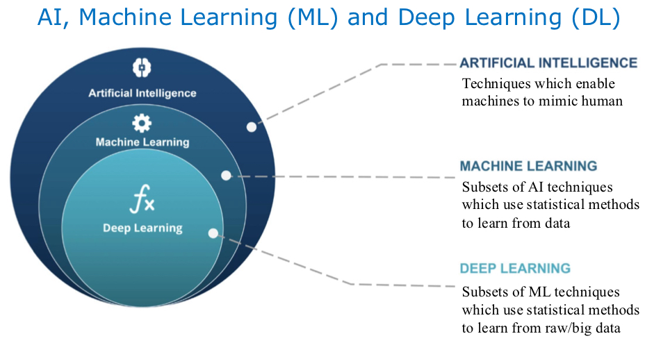

**AI (Artificial Intelligence):**
The broadest term, AI refers to the simulation of human intelligence in machines, enabling them to perform tasks that typically require human cognition, such as reasoning, problem-solving, and decision-making.

**ML (Machine Learning):**
A subset of AI, ML involves training algorithms to learn patterns from data and make predictions or decisions without explicit programming. ML models improve performance with more data over time.

**DL (Deep Learning):** 
A specialized subset of ML, DL uses neural networks with multiple layers (deep neural networks) to process large amounts of data and perform complex tasks such as image recognition, natural language processing, and autonomous driving.

## Categories of Machine Learning

**Supervised learning:**
- label/ground-truth of data is given
- A type of machine learning where the model is trained on labeled data, mapping inputs to known outputs.

**Unsupervised learning:**
- label/ground-truth of data is unknown.
- A type of machine learning where the model finds patterns and structures in unlabeled data without predefined outputs.
- transforming the data into other representations.
- ex: image processing, e.g., local binary pattern  
clustering: e.g., k-means clustering

**Reinforcement learning:**
determine the optimal policy (i.e., the best
set of actions) based on the `reward` learn from the `environment`.

## Computer Vision
Make the computers understand images and videos. Identify relationships between objects in the image through image processing.

**More Applications: Vision in Space**  
Vision systems (JPL) used for several tasks:  
- Panorama stitching:  
① detect feature points in image pairs.  
② Find matching features in adjacent images.  
③ Use a unified coordinate sys, to stitch the images together.
- 3D terrain modeling:  
① Detect feature points  
② obtain camera projection matrix.  
③ project those feature points back to their 3D coordinates
- Obstacle detection, position tracking
- For more, read “Computer Vision on Mars” by Matthies et al.

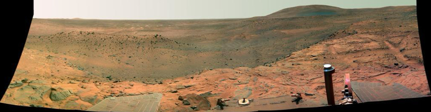

# Data Representation and Normalization (week: 02/24)
- Conventional ML : Use engineered (human selected) features to train model
- DL : Train model with raw data, the model will automatically extract features for you

## Data Representation
prior to training a model, you must determine:  
➢ label ground-truth: eg. binary classification 0 or 1  
➢ representation of input:  
> - raw data : DL
> - transform to other features : ML

## Normalization (Feature scaling)
**When:** Input features have different order of magnitudes  
**Why:** poor performance due to:  
➢ Dominance of feature  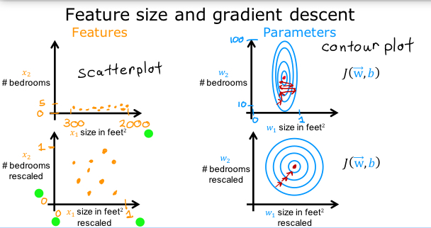   
➢ Numerical stability  
➢ Convergence issues  

**Methods:**
-  Min-Max Normalization:  (normalize to 0 - 1)  
$x[:, j]_{normalization} = \frac{x[:, j] - min(x[:, j])}{max(x[:, j]) - min([:, j])}$    
    ➢ Feature-wise scaling, across all the samples  
    ➢ Most common scaling technique  
    ➢ cons: think about inherent constraints in physics

- Mean normalization:
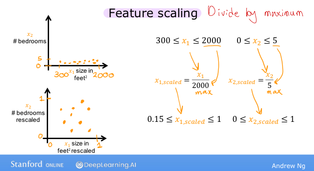
- Z-score:
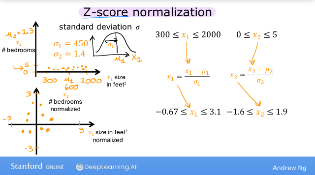

**How to apply:**  
- Classification  
➢ Usually no scaling in outputs.  
➢ Need scaling in inputs.  
- Regression  
➢ Usually need to scale in both inputs and outputs.  
➢ If you do scaling while training the model, need scaling    during testing  

    **🔹Testing Data:**  
    1. apply feature transformation  
    2. scaling input & output using the same scaling factors   employed during training
    3. scale the predictions back to original values. 

    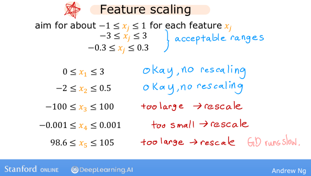


# Model evaluation (week: 02/27)

## Assumption in Machine Learning
- How you determine your training dataset so that your model works
on the unseen (test) dataset?  
    1. Training dataset must be ``representative enough``
    2. In other words, training and testing datasets are  `on the same distribution`  

    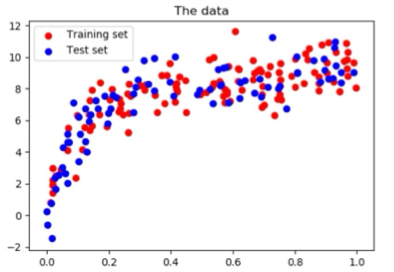

## Robustness Evaluation
**Goal:** check how bad your model could be when you change your selection of training and testing data set.  
1.  Do **repeated trials**! (Change the selected training and testing)
2.  show **statistics** of the performance of your model on
the **testing dataset**  ex: boxplot, normal distribution of multiple trials.

## Overvitting 
 **Overfitting:** model works well on training dataset, but performs poor on testing dataset.  
 - Blue dots: 2D feature vectors of men images  
 - Red dots: 2D feature vectors of women images  
 - Green curve: an overfitted model
 - Black curve: a more general model

 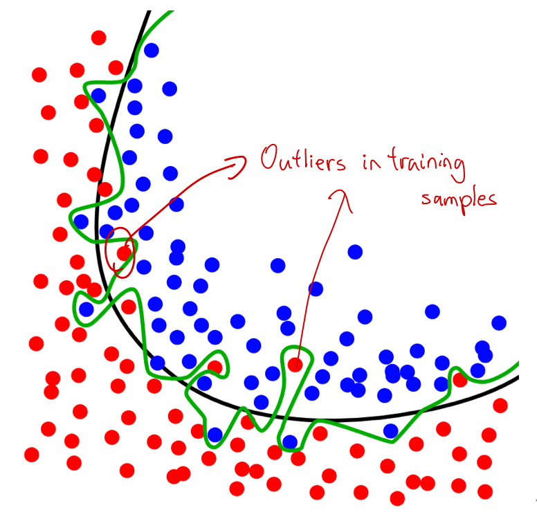  

 > *Detect Outliers: Suppose small portion of outliers => How to detect outliers?  
Once the model is trained appropriately it should be a general model. Feed the training samples into the model to make predictions. the samples with relatively larger
**"prediction error"** could be potential outliers.

### Reasons and solutions to Overfitting
1. Training dataset is not representative 

    ➔ re-select the training samples  

2.  Model complexity is high  

    ➔ reduce the model complexity  

3.  Train too much   

    ➔ reduce the number of training epochs

### When to stop Training
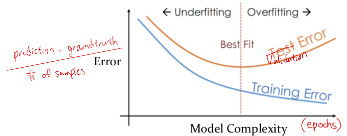 

1. keep testing dataset for final evaluation
2. Stop when error(loss) on **validation dataset start to increase**   

(Overfit: accuracy of training dataset high validation low. Underfit:accuracy of training dataset low validation low )

## Confusion matrix and Accurracy
### **Example Interpretation of a ROC Figure & Using Confusion Matrix**

#### **Scenario: Fraud Detection Model**
We trained a **binary classification model** to detect fraudulent transactions. The **ROC curve and AUC score** help evaluate model performance, while the **confusion matrix** shows how predictions are classified.

---

### **1️⃣ Understanding the ROC Figure**
#### **Given Data:**
- **AUC = 0.87**
- The **ROC curve rises steeply** and approaches the top-left corner.

#### **Interpretation:**
- **AUC = 0.87** → The model is **good at distinguishing fraud and non-fraud cases** (87% accuracy in ranking).
- The **curve is above the diagonal line**, meaning the model performs **better than random guessing**.
- A **higher threshold** (e.g., 0.8) reduces false positives but increases false negatives.
- A **lower threshold** (e.g., 0.3) catches more fraud cases but also increases false alarms.

📌 **If detecting fraud is critical**, we **lower the threshold** to **increase recall** (catching more fraudulent cases).

---

### **2️⃣ Confusion Matrix Interpretation**
The **confusion matrix** helps analyze classification errors at a chosen threshold.

#### **Confusion Matrix Example (Threshold = 0.5)**
| **Actual \ Predicted** | **Non-Fraud (0)** | **Fraud (1)** |
|------------------------|------------------|--------------|
| **Non-Fraud (0)**  | 900(TP) | 50(FN) |
| **Fraud (1)** (FN) | 30(FP)  | 20(TN) |

📌 **Key Metrics from the Confusion Matrix:**
- **True Positives (TP) = 20** → Fraud correctly detected.
- **False Positives (FP) = 50** → Non-fraud wrongly classified as fraud.
- **True Negatives (TN) = 900** → Correct non-fraud classifications.
- **False Negatives (FN) = 30** → Fraud cases **missed** by the model.

📌 **Key Insights:**
1. **Precision (TP / (TP + FP)) =** 20 / (20 + 50) = 0.29 (29%)
   - **Low precision** → Many false positives (wrongly flagged transactions).
2. **Recall(TPR) (TP / (TP + FN)) =** 20 / (20 + 30) = 0.40 (40%)
   - **Low recall** → Many fraud cases are missed.
3. **Accuracy = (TP + TN) / (Total Predictions)** = (20 + 900) / 1000 = 92%
   - **Accuracy is high, meaningless if dataset is highly unbalanced.** Might be misleading if fraud cases are rare.
4. **FPR = FP / (FP + TN)** = 30 / (20 + 30) = 60%
---

### **3️⃣ Adjusting the Threshold Using ROC**

- **Lower the threshold (e.g., 0.3)** → Increases recall (fewer missed frauds) but may increase false positives.
- **Raise the threshold (e.g., 0.7)** → Reduces false positives but **misses more fraud cases**.  

#### When to Prioritize High TPR(better) or Low FPR(better)?
**Trade-off:** high TPR often comes at the cost of a high FPR 
**Solution:** Combine high TPR with precision to avoid too many false positives.
| **Scenario** | **Prioritize High TPR (Low FN)?** | **Prioritize Low FPR (Low FP)?** |
|-------------|--------------------------------|------------------------------|
| **Medical Diagnosis (e.g., Cancer, COVID-19)** | ✅ Yes (Missing a real case is dangerous) | ❌ No |
| **Spam Detection** | ✅ Yes (Better to overfilter than miss spam) | ❌ No |
| **Fraud Detection** | ✅ Yes (Better to block fraud than allow it) | ❌ No |
| **Airport Security Screening** | ✅ Yes (Better safe than sorry) | ❌ No |
| **Hiring/Resume Screening** | ❌ No | ✅ Yes (Avoid rejecting good candidates) |
| **Autonomous Vehicles (Self-Driving Car Stop System)** | ❌ No | ✅ Yes (Avoid unnecessary stops) |
| **Criminal Investigations** | ✅ Yes (Find suspects) | ✅ Yes (Avoid accusing the wrong person) |

---

### **4️⃣ When to Use ROC vs. Confusion Matrix?**
| **Situation** | **Use ROC-AUC?** | **Use Confusion Matrix?** |
|--------------|-----------------|----------------------|
| Overall model performance | ✅ Yes | ❌ No |
| Deciding the best threshold | ✅ Yes | ✅ Yes |
| Analyzing classification errors | ❌ No | ✅ Yes |
| Imbalanced dataset | ❌ No (Use PR-AUC) | ✅ Yes |

---


### **-Final Takeaways**
✔ **ROC Curve** helps determine **optimal threshold trade-offs**.  
✔ **AUC Score** summarizes model performance (**higher is better**).  
✔ **Confusion Matrix** shows actual vs. predicted classifications.  
✔ **Threshold tuning is necessary** to balance precision and recall.

## Support Machine Vectors
**Support vector machine (SVM)** is a very popular algorithm in
machine learning (ML) community.
- Can do classification problems.  
- Can do regression problems.  
- Find the hyperplane that separates different classes.  
- May require a kernel function to project the data into higher
dimension spaces.  

    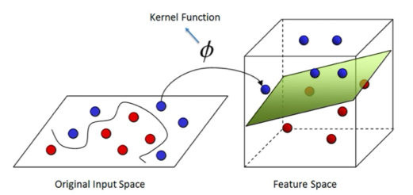

### Hard SVM (Linearly-Separable Case)
Recall on a 2D plane, we define a line with the equation:  
- $𝑙: 𝐴𝑥 + 𝐵𝑦 + 𝑏 = 0$  
- In SVM, we usually denote the inputs as $𝒙_{i} = [x_{1}, x_{2},...,x_{p}]^{T}$,, and the
corresponding label as $y_{i} = [1 or -1]$  for binary classification.
- Assume the input space is 2D (i.e., 𝑝 = 2), the same line $l$ can be
represented as: 
$$
w = 
\begin{bmatrix} 
  A \\
  B \\ 
\end{bmatrix}, 

x = 
\begin{bmatrix} 
  x_{1} \\
  x_{2} \\ 
\end{bmatrix},
𝑙: w^{T}𝑥 + 𝑏 = 0
$$
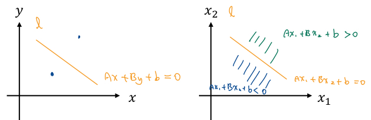

- Define the hyperplane: $H_{0}:  w^{T}_{0}x + b_{0} = 0$, we want to find the optimal 𝒘 so that the margin is the largest.  
Why largest margin? Ans: Avoid Overfitting
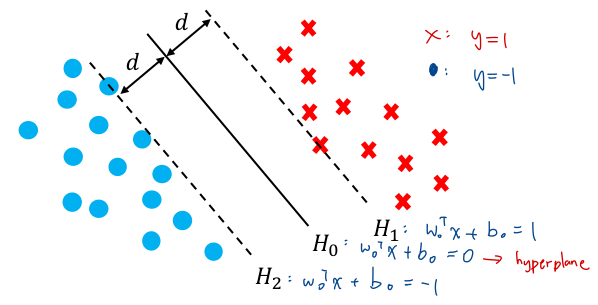

- How to compute the margin?

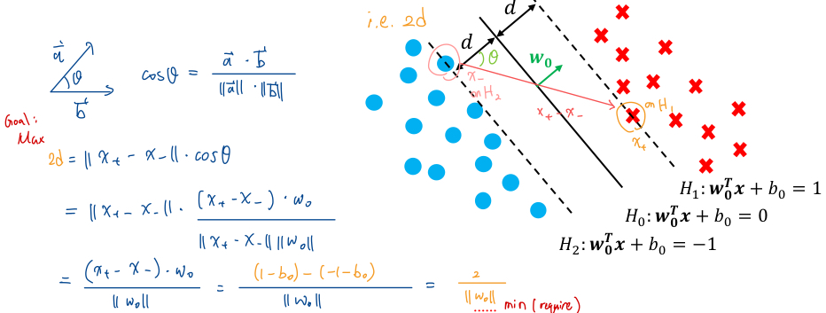  
  
  -  Support vectors: points on 𝐻1 and 𝐻2: $x_{+}$ & $x_{-}$
   - To maximize the margin 2d, we need to minimize $\left \| w \right \| \ $
   - to minimize $\left \| w \right \| \ $, we should minimize 

       $min(\frac{1}{2}w^{T}w) = \frac{1}{2}\left \| w \right \|^{2}$    
       subject to $y_{i}(w^{T}x_{i}+b)\geq 1, i = 1,...,n$

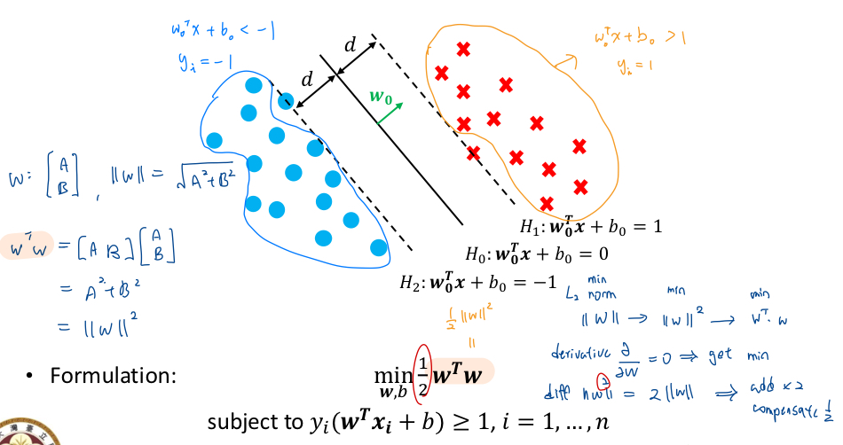 
    
### Soft SVM (Non-Separable Case)
#### What if there are Noise/Outliers:
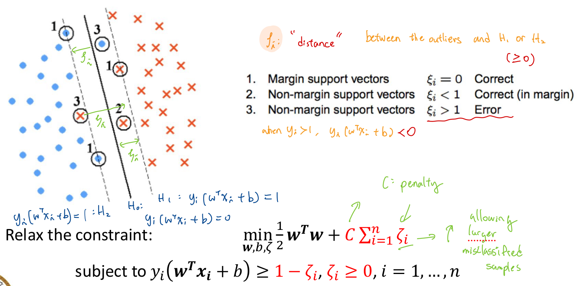 

- we can relax the constraint by    
➜ decreasing penalty C (to increase $\zeta_{i}$ allowing more misclassified examples)

#### What if the data cannot be separable in the original space?
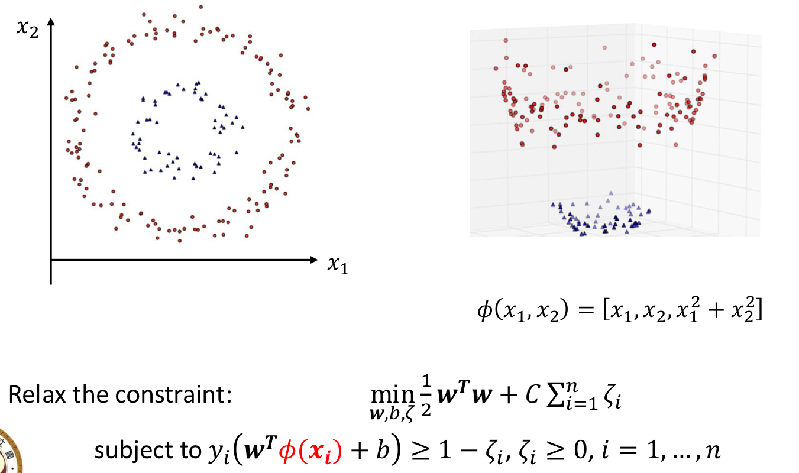

- Use a kernel function 𝜙(∙) to map the inputs into a higher dimensional space to be separated with a hyperplane.  
- Once you map the inputs, following the same formulation in soft SVM.

### Remarks
- These SVM is a **constrained optimization**(vs.unconstrained) problem
- The equations mentioned above are **primary form** of SVM
-  However, in practice the above optimization problem is solved by its **dual form**.  
>#### **Dual form :**
>- leverages the **kernel trick**, making the
optimization process **more efficient**  
>- can be implemented using gradient descent
>- Instead of optimizing 𝒘 explicitly, the dual form only
depends on the on the samples $x_{i}$ through kernel products.   
 $\sum \alpha \cdot \phi ( x _ { i } ) \cdot \phi ( x _ { j } )$  
>- There are other variants of SVM algorithms. SVM can also be used in
**regression problems**.
>- Further reading:  
Ch. 11.5 in: http://ciml.info/dl/v0_99/ciml-v0_99-ch11.pdf  
scikit-learn: https://scikit-learn.org/stable/modules/svm.html#mathematical-formulation

### Hyperparameters
- any parameter in the algorithm that may affect the
performance.
- Usually you need to do **hyperparameter tuning** to find the best parameter set for your model.
any parameter in the algorithm that may affect the
performance.
- some important hyperparameter:

  - penalty 𝐶  
  - kernel function. E.g.: linear, polynomial, Radial Basis Function (RBF)  
  - Parameters in the kernel function

## K-nearest Neighbor
#### Steps:
1. Prepare a training dataset.
2. Apply appropriate **feature transformation**.  
3. Given a testing sample, compute the **distance** between the **testing sample** and **each training sample**.  
4. **Sort** the distances, and **choose the K value**.
5. Assign labels based on the **majority vote** of the K-nearest neighbors.
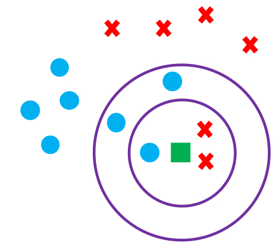

#### Hyperparameters:
- The K value.  
- The feature transformation you use.  
- The distance metric you use. eg:  
  
  $L2 norm:$ 
     $$
    w = 
    \begin{bmatrix} 
    A \\
    B \\ 
    \end{bmatrix}, 
     \left \| w \right \| \ ^2 = \sqrt { A ^ { 2 } + B ^ { 2 } }
    $$  

    $L1 norm:  | | \overrightarrow { w } | | = | A + B | = | A | + | B |$

#### Brainstorming:
- How does the **K value relate to overfitting**?  
    ➜  smaller 17 has the tendency to overfit eg. K = 1, affected by outliers.

- Is there any **“training”** involved in the solution process?  
    ➜ since you are just computing the distance between the testing samples and the training samples.

- Can K-nearest neighbor do **regression problems**?  
    ➜ yes, use **weighted average** $ \propto\frac { 1 } { distance} $ of the training samples.
    
    - prediction:   
      $v _ { 1 } \cdot \frac {\frac { 1 } { d _ { 1 } } } { \frac { 1 } { d _ { 1 } } + \frac { 1 } { d _ { 2 } } + \frac { 1 } { d _ { 3 } } } + v _ { 2 } \cdot \frac {\frac { 1 } { d _ { 2 } } } { \frac { 1 } { d _ { 1 } } + \frac { 1 } { d _ { 2 } } + \frac { 1 } { d _ { 3 } } } + v _ { 3 } \cdot \frac {\frac { 1 } { d _ { 3 } } } { \frac { 1 } { d _ { 1 } } + \frac { 1 } { d _ { 2 } } + \frac { 1 } { d _ { 3 } } } $
      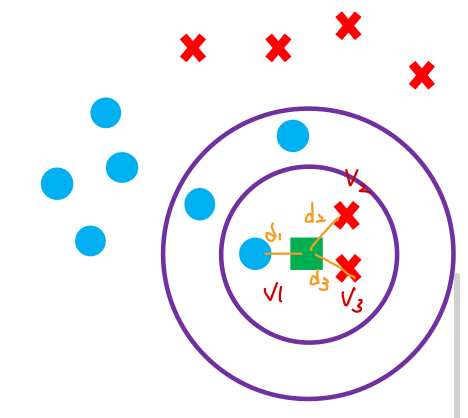

## Decision Tree (03/13)  
 Decision tree (DT) is a straightforward algorithm in machine learning (ML).

- Usually used in classification problems.  
- Make prediction based on attributes, i.e., features.  
- Rule-based ML.  
- Core concept: determine the optimal order of features to be used in the tree. 

### Entropy
a measure of **disorder**.
>$$
\text{$H(p_1, p_2, ..., p_K) = - \sum_{i=1}^K p_i \log_2(p_i)$}
$$
- The higher the entropy, the higher the disorder.
- $𝑝𝑖$ : the probability of a sample being Class $𝑖$. $𝐾$: number of classes.  
Example:  
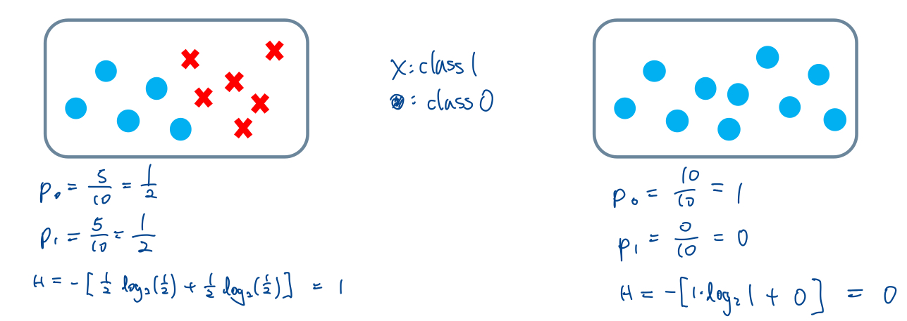
- Intuition: At each **parent node**, pick the **feature** such that, the resulting **entropy** at the **children nodes** are **minimized**.  
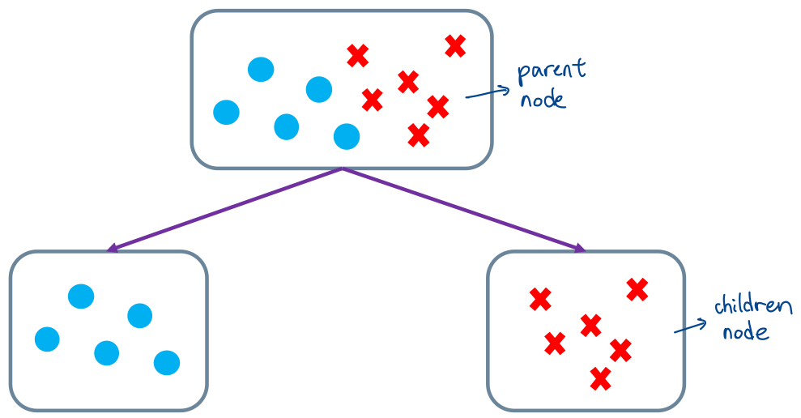  

### Information Gain
How much you reduce the entropy.
<div style="text-align: center;">
    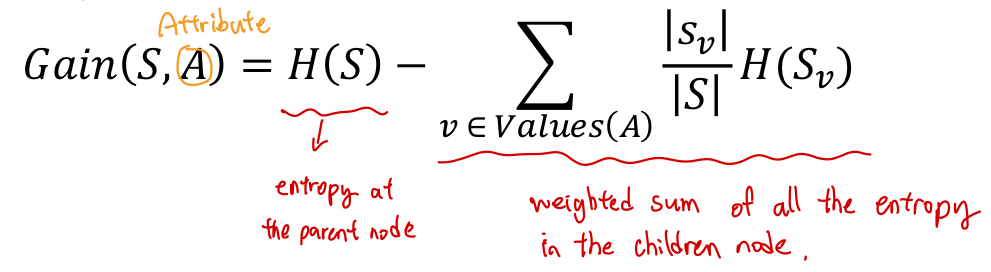
</div>

$𝑆$ : samples at parent node; $𝐴$: the selected feature; $𝑣$: values in feature $𝐴$; $|𝑆|$ number of samples at parent node; $|𝑠_{𝑣}|$ number of samples at child node when $𝐴 = 𝑣$.   
> ➜ Objective : At each **parent node**, find the feature $𝐴$ so that the **information gain** is the **largest**.

### Calculation

- DT Example:   
Will I play badminton today?  
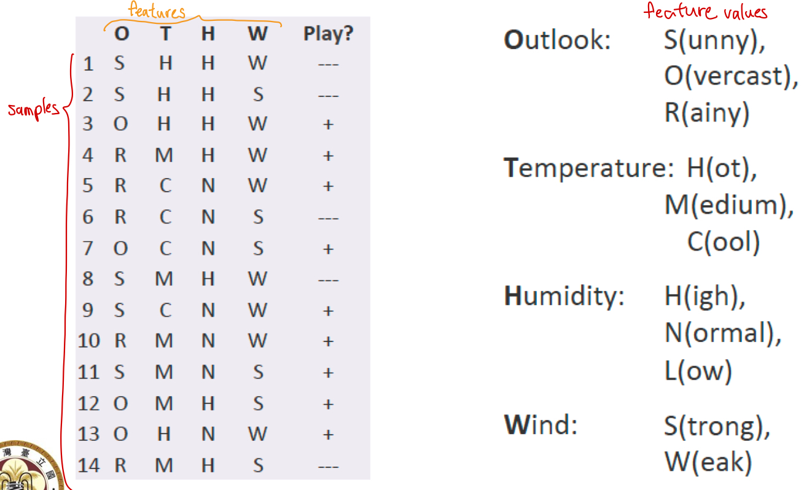

1. Current Entropy (Parent node $H(s)$)  
   $p = \frac{9}{14}$

    $n = \frac{5}{14}$

    $H(s, label)=-\frac{9}{14} log_{2} (\frac{9}{14}) -\frac{5}{14} log_{2} (\frac{5}{14})\approx 0.94$
2. Determine children node  
- calculate each features information gain, select the highest.  
    > **Outlook :**  
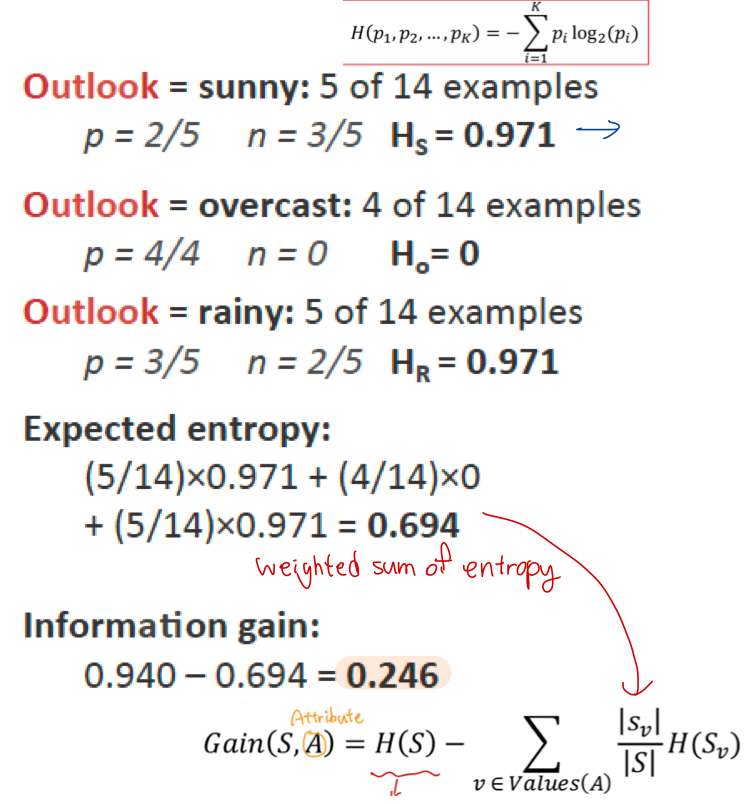   
**Humidity :**  
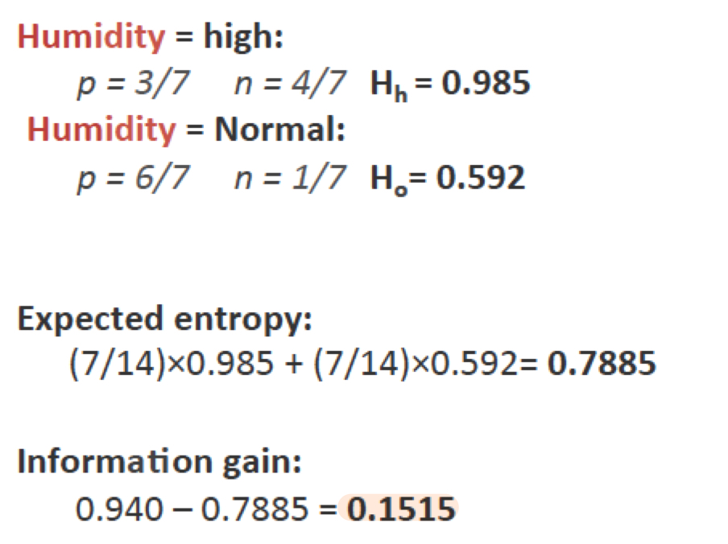  
Temperature, Wind same calculation  

    >Information Gain:   
    >- Outlook: 0.246 (max)  
    >- Humidity: 0.151
    >- Wind: 0.048 
    >- Outlook: 0.029   

3. **Select & Split** on Outlook:  
Do the same thing at the next layer child node    
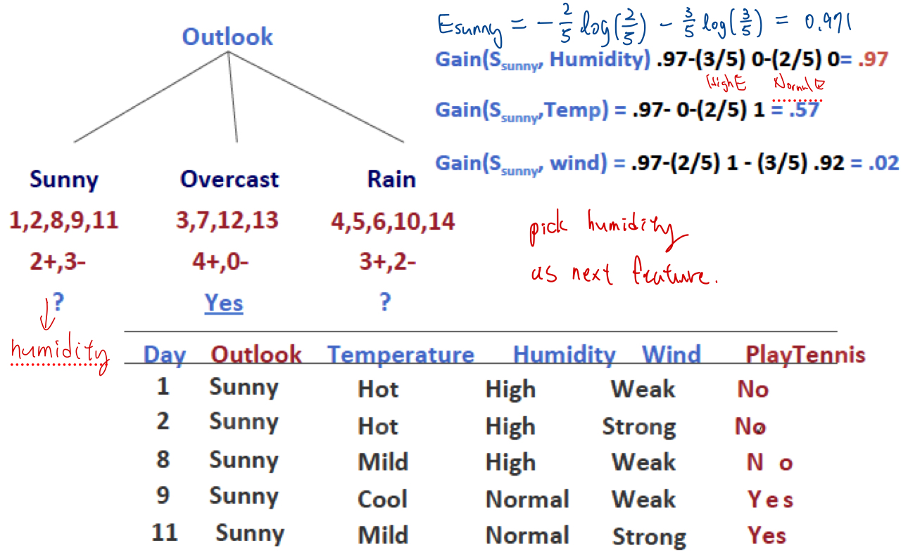 
4. Final Results :  
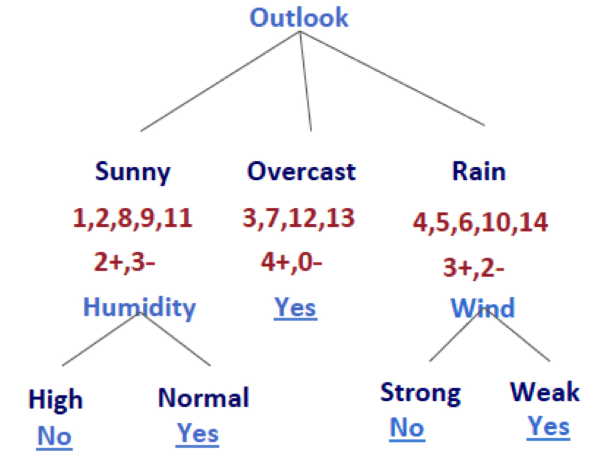
      
- Note: If the **final entropy** at the children nodes are **not zeros**, do **major voting**.

### Avoid Overfitting and Other Variants of DT
- Strategies to avoid overfitting
    - Fix the **depth** of the tree.  
    - Check the performance of the **validation** dataset **while growing** the tree. Stop growing the tree if overfitting is observed.  
    - **Post pruning**: replace the sub-tree with majority vote.  
- Other variants of DT:
    - Random forest (RF).  
    - RF is an **ensemble learning** based approach. RF aggregates the
prediction of multiple decision trees.  <br><br>
    
# Neural Networks (03/13)
- The idea of a neural networks (NNs):   
NNs learn relationship between cause(input) and effect(output) or organize large volumes of data into orderly and informative patterns.  
- Inspiration from Neurobiology:  
    - A biological neuron has three types of main components: dendrites, soma (or cell body) and axon.  
    - Dendrites receives signals from other neurons.  
    - The soma, sums the incoming signals. When sufficient input is received, the cell fires, that is, it transmit a signal over its axon to other cells.

- Artificial neurons:  
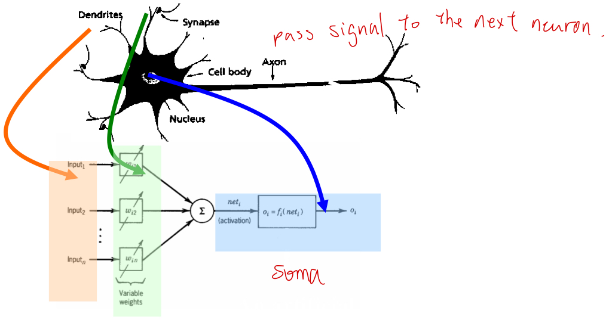  
    - From experience: examples / training data  
    - Strength of connection between the neurons is stored as a weight-value
    for the specific connection  
    - Learning the solution to a problem = changing the connecting weights

## Network Architecture  
- A typical neural network (NN):  
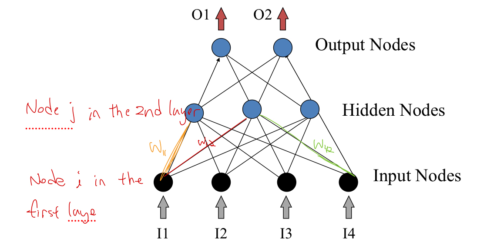  
    - A neural net consists of a large number of simple processing elements
    called **neurons**, units, cells or nodes.  
    - Each **neuron** is **connected** to other neurons by means of directed
    communication links, each **with associated weight**.
- Consider a single neuron:  
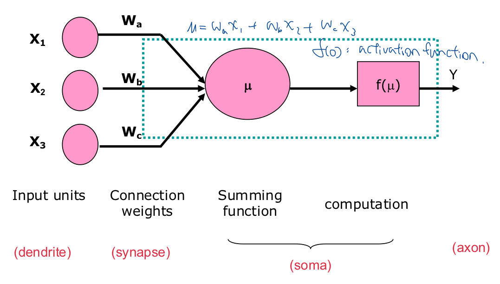  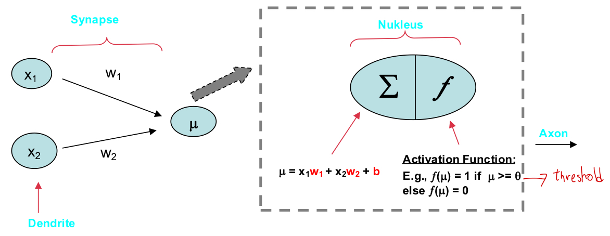   
    >- Why do we need an activation function?  
    >learn Non-linear relationship between input and output.  

## Activation functions:
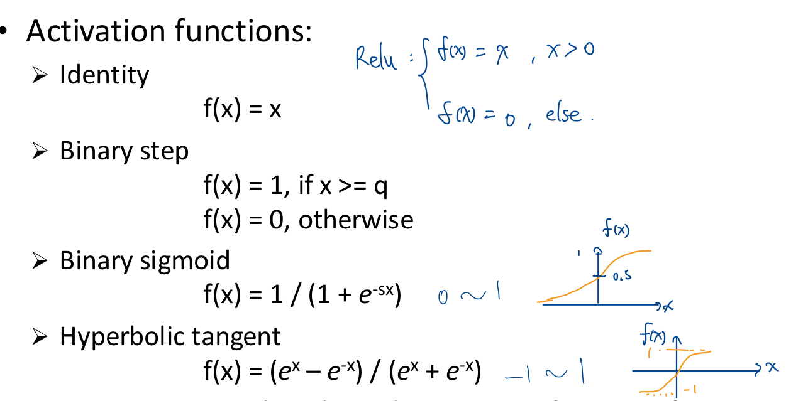  

➢softmax:f(x) = probability distribution  
> Softmax is for output layers (to get probabilities).
Hidden layers use ReLU, Tanh, Sigmoid, etc. — not Softmax.  
🔹 ReLU / Sigmoid / Tanh:  
**ReLU**: max(0,x) → introduces non-linearity and sparsity, fast to compute   
**Tanh**: outputs between -1 and 1 → centered.  
**Sigmoid**: outputs between 0 and 1, not normalized like softmax.
These are commonly used in hidden layers to learn representations.
🧠 Why Not Softmax in Hidden Layers?  
Reason	Explanation  
🔒 Restricts learning:	Softmax forces all activations to sum to 1 → reduces expressive power.  
🧠 Not sparse:	Unlike ReLU (which can zero out many values), softmax usually gives small non-zero values to all neurons.  
⚙️ Slower & costlier:	It involves exponentials and divisions — more expensive than ReLU.  
❌ No need for probabilities: 	Hidden layers are not about classification directly; they learn features. Probabilities aren't useful here.  

## Output layers  
- Activation functions at output layers:  
    - Output layer: making predictions  
    - Task dependent: **classification VS regression**
    - Classification: usually use **Softmax**function  
    - Regression: **pure linear** or **hyperbolic tangent**
- Hyperbolic tangent(for regression):  
<div style="text-align: center;">
    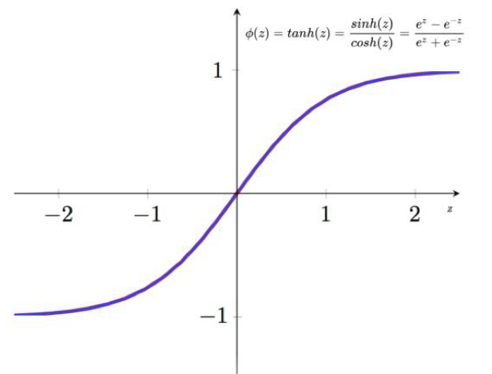
</div>    

>   * The outputs are bounded. → cannot represent larger values  
>   * Proper scaling of the labels are usually required.  
- Multi-Class output (classification):  
<div style="text-align: center;">
    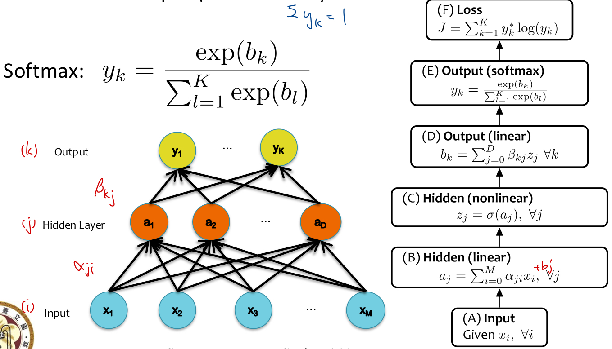
</div>  


## Training a Neural Network
### 1. A **forward pass** during training:  
- Start with **randomly initialized weights**.  
- Given a training sample, compute the prediction of the network  
 - Compute the **discrepancy** (i.e., the **loss**) between the prediction and the
    target. The function used to compute the loss is called the **objective function**.  
- Update the **weights** of the network using the loss. (ex. gradient descent)    


### 2. Objective (Loss) Functions
- Objective Functions for NNs:  
    - **Regression**    
        - Quadratic loss (i.e. mean squared error)    
        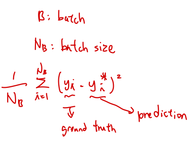 
    - **Classification**  
        - Cross-entropy (i.e. negative log likelihood)  
        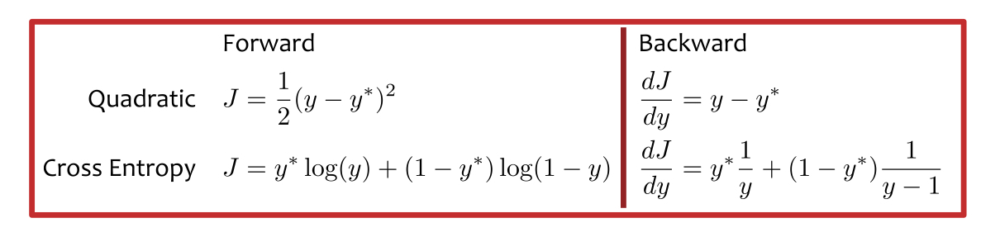  

### 3. Backpropagation  
1. Takes the loss from the forward pass 
2. Efficiently calculating all the **partial derivatives** using the **chain rule** layer by layer, backward through the network.
3. Get gradients:  compute
    - $\frac{\partial L}{\partial W_i}$ — how the loss changes w.r.t. each weight
    - $\frac{\partial L}{\partial b_i}$ — how the loss changes w.r.t. each bias 

> - Backpropagation = Gradient Calculator  
> - Optimizer = Gradient User

No matter how smart or fancy the optimizer is (e.g., Adam, RMSprop, Adagrad...), it still needs gradients — and backprop gives them.    
Example:  
  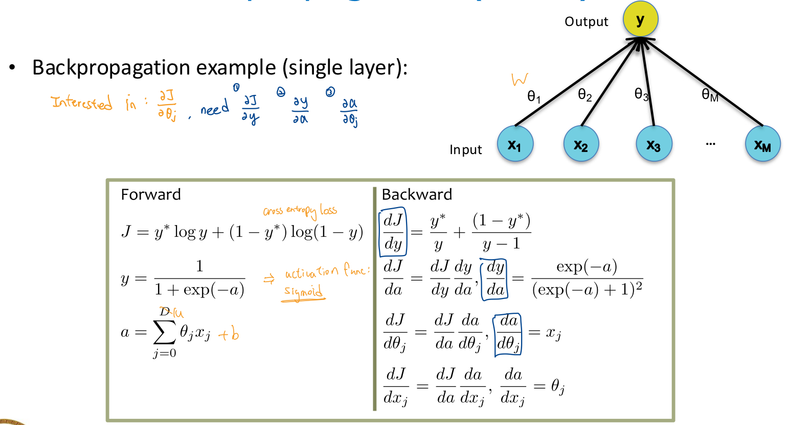  
  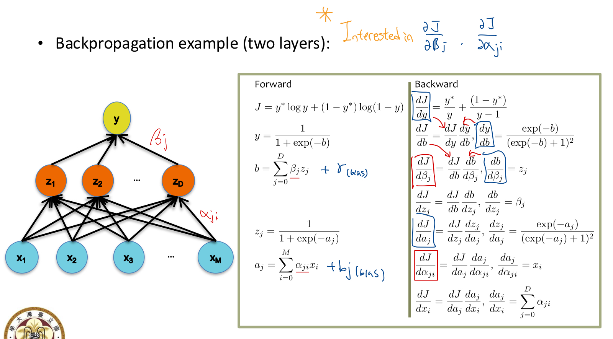    

### 4. Optimizer : Gradient Descent  
  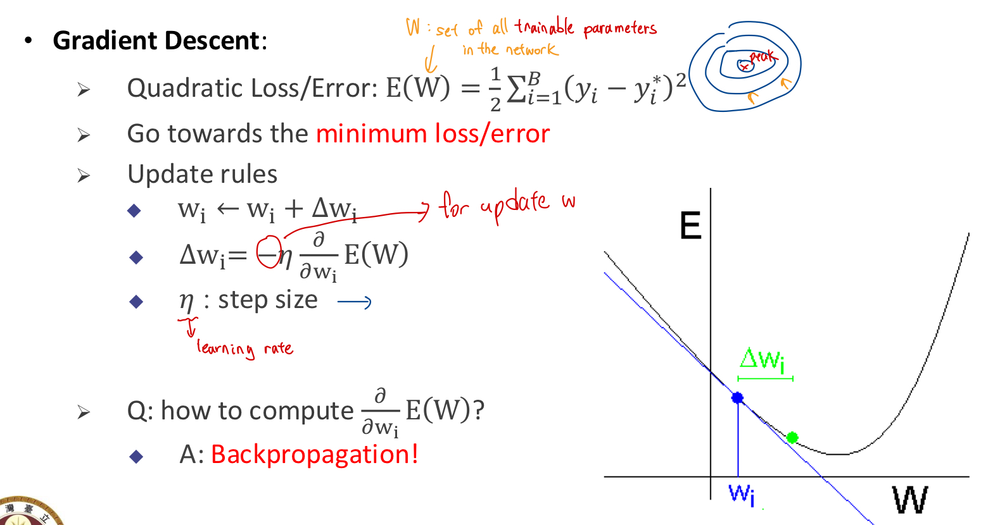  
  
  >- the gradient points toward the direction of the steepest increasing of the function, since we want minimize the error, we update the parameters using the opposite direction of the gradient.  
#### learning rate: $\quad$ $\theta \leftarrow \theta - \eta \cdot \frac{\partial L}{\partial \theta} $  
1. start with commom default:  

    Most libraries and optimizers come with **well-tested defaults**   
    | Optimizer | Common Default Learning Rate |
    |----------|-------------------------------|
    | SGD (no momentum) | `0.01` |
    | SGD + Momentum     | `0.1` |
    | Adam               | `0.001` |
    | RMSprop            | `0.001` |  
2.  Watch for Signs in the Loss Curve:   

    | Behavior | Likely Issue | Action |
    |----------|--------------|--------|
    | 📉 Loss decreases smoothly | ✅ All good! | Continue |
    | 🔁 Loss plateaus | LR too low | Increase slowly |
    | 🚀 Loss spikes or oscillates wildly | LR too high | Decrease 10x |

    > 💡 Rule of thumb: Try changing it by a factor of **2 or 10** at a time.
3. Tips  

    | Tip | What to Do |
    |-----|------------|
    | 🚀 LR too high? | Decrease by 10x |
    | 🐌 LR too low? | Increase by 2x or 10x |
    | 🧪 Not sure? | Try LR Finder |
    | 📉 Stuck loss? | Try a scheduler or reduce LR |
    | 🧠 Fine-tuning? | Use smaller LR |
    | 📊 Validation loss unstable? | Use `ReduceLROnPlateau` |
4. Other commom optimizers:  
- Stochastic gradient descent (SGD)
- Adam  
SGD sudo code:  
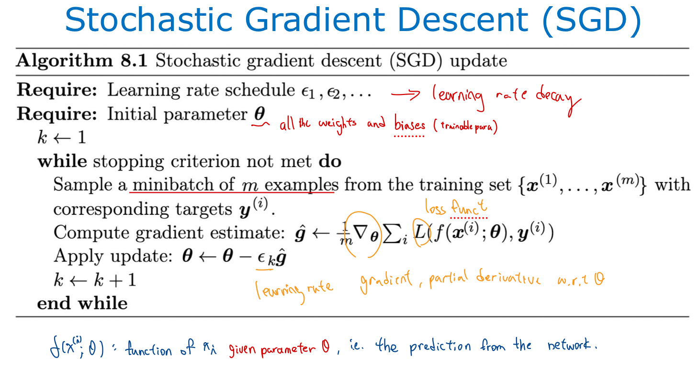

### 5. Avoid overfitting:      
Strategies to avoid overfitting:  
 - Check the performance of the validation dataset while training. Stop
    training if overfitting is observed.  
- Use dropout layers. (May not be useful.)  
- Use less number of training epochs.  
- Reduce the number of trainable parameters.

## Neural network application  
- Voice recognition:  
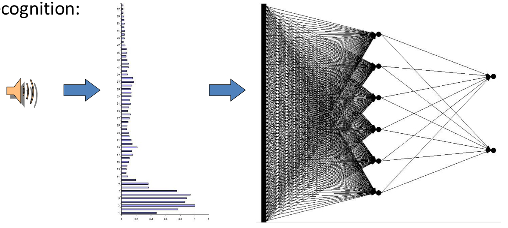
- require transformation of input signals into feature vectors.  
- Q: What if our input data is an image? $\quad$ loose spacial correlation
  

# Image Basis and Image Filtering  
## Image units  
### Pixel  
- The word pixel is based on a contraction of pix ("pictures") and el (for
"element").  
- In digital imaging, a pixel, is a physical point in a raster image, or the
smallest addressable element in a display device.  
### Pixel Indices  
- Often, the most convenient method for expressing locations in an image
is to use pixel indices. The image is treated as a grid of discrete elements,
ordered from top to bottom and left to right.  
## Image Types  
### Binary image  
In a binary image, each pixel assumes one of only two discrete values: 1 or 0.  

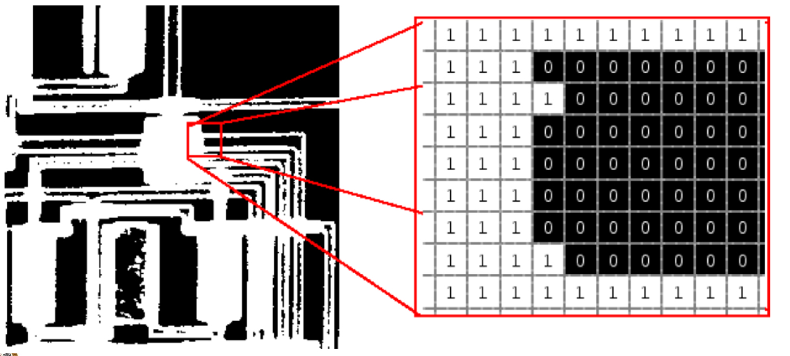  

### Grayscale image  
A grayscale image (also called gray-scale, gray scale, or gray-level) is a
data matrix whose values represent intensities (pixel values) within some range, (0 black – 255 white(unsigned integer) or 0 – 1(double)).   

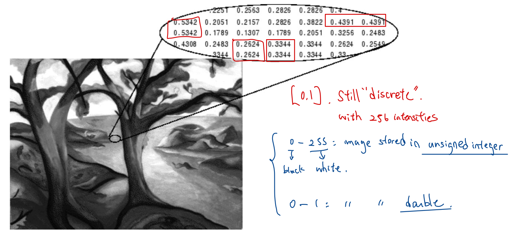   

### Visual Perception in Grayscale Images  
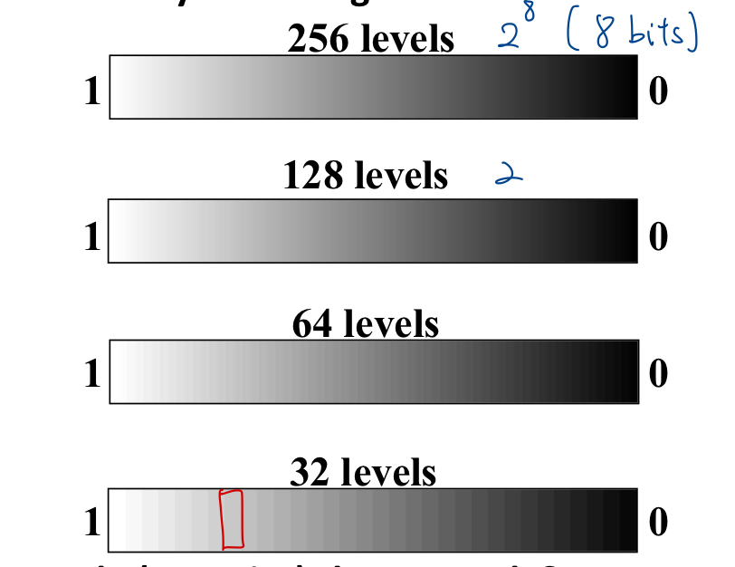     

- How much to sample (quantize) the grayscale?
    - Humans can distinguish in the order of 100 levels of gray (about 40 to
    100).  

### Color image  
A true color image is an image in which each pixel is specified by three
values — one each for the red, blue, and green components of the
pixel's color. The color of each pixel is determined by the combination of
the red, green, and blue intensities stored in each color plane at the
pixel's location.  
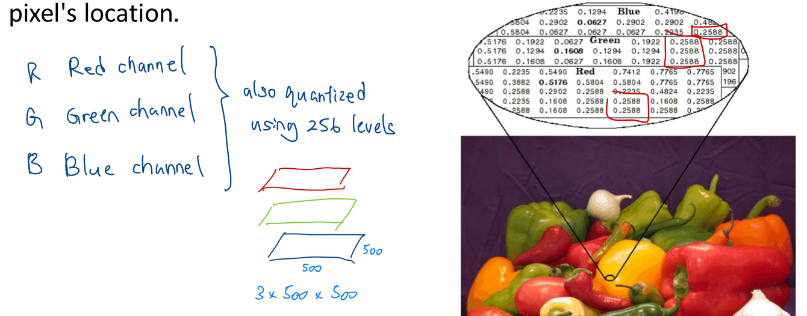   
### Data Types in Computer  
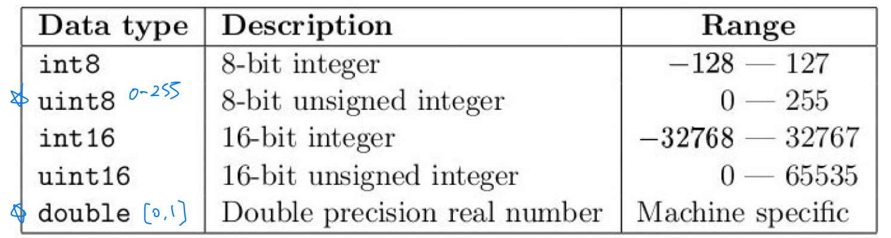   

### Histogram in Grayscale Images  
Given a grayscale image, its histogram consists of the histogram of its
gray levels; that is, a graph indicating the number of times each gray
level occurs in the image.
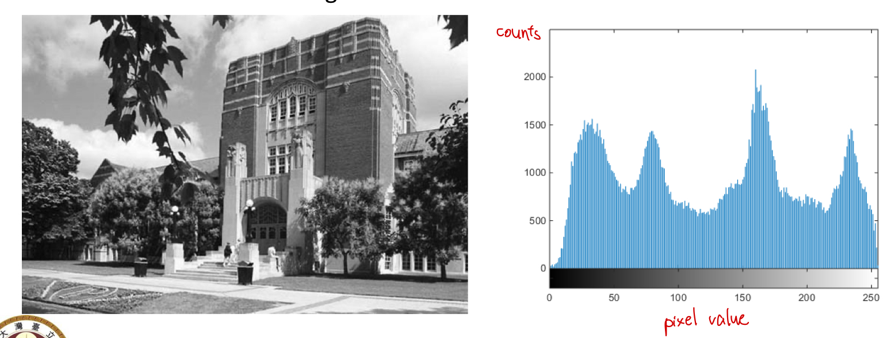   
We can infer a great deal about the appearance of an image from its
histogram.  
1. In a **dark image**, the gray levels would be clustered at the lower end  
2. In a **uniformly bright image**, the gray levels would be clustered at the
upper end.  
3. In a **well-contrasted image**, the gray levels would be well spread out
over much of the range.  
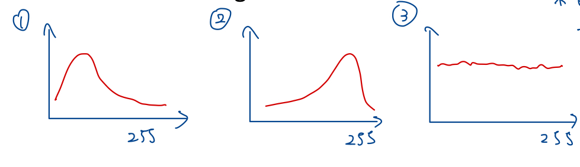  
>   Enhance contrast ➜ image histogram equalization  

## Image filtering  
### Representation in math  
Think of a (grayscale) image as a function, f, from $R^2$
 to $R$(or a 2D signal):  
- f(x,y) gives the intensity at position (x,y)
- A digital image is a discrete (sampled, quantized) version of this function.  
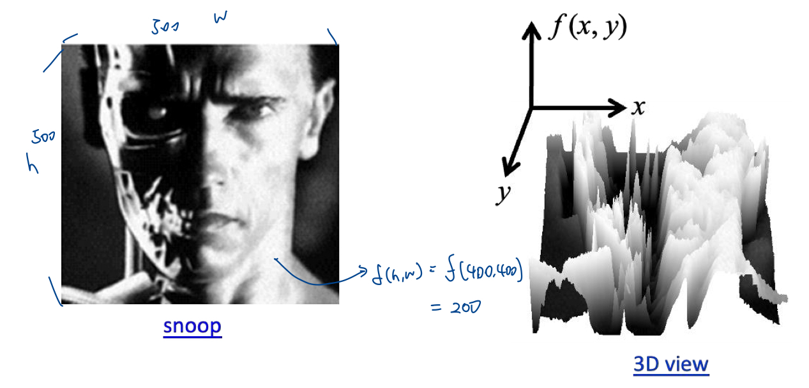  
### Image transformation  
- Brightening:  
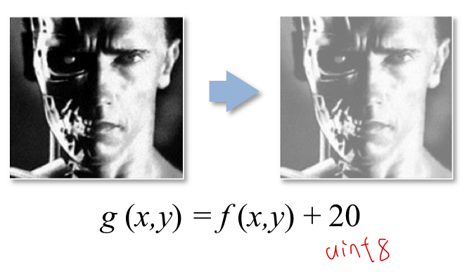  
- mirror:  
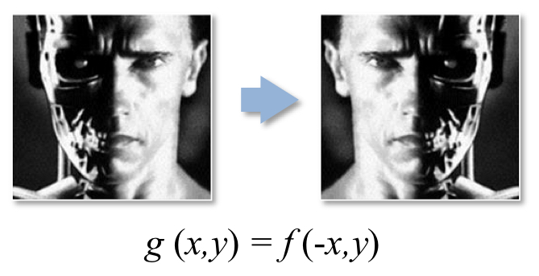  
- noise reduction:  
You could try **averaging the pixels** within a user-specified window!  
   

### Image filtering  
Modify the pixels in an image based on some function of a local
neighborhood of each pixel.  
  
#### Linear filtering:  

 - ex: **cross-correlation**(not flip kernal),   **convolution**(flip)
- Replace each pixel by a linear combination of its neighbors.  
- The prescription for this linear combination is called the “kernel” (or
    “mask”, “filter”).  
      
    - ex: Cross-correlation, Convolution  
    
- **Cross-correlation**:  
Let F be the image, H be the kernel (of size 2k+1 x 2k+1), and G be the
resulting image after doing cross-correlation:  

    $G[i,j]=\sum_{u=-k}^{k}\sum_{v=-k}^{k}H[u,v]F[i+u, j+v]$  

    Notation: $G=H\otimes F$  
- **Convolution**:  
same as the cross-correlation operation, except that the
kernel is “flipped” horizontally and vertically:  

    $G[i,j]=\sum_{u=-k}^{k}\sum_{v=-k}^{k}H[u,v]F[i-u, j-v]$  

    Notation: $G=H*F$  
    Convolution is  
    commutative $F*H=H*F$ ,   
    associative $(G*H)*F=G*(H*F)$    
      
- **zero padding**:  
convolution often causes size reduction, use zero padding to avoid.  
    
>- **filters**(kernal):  
>     1. size reduction  
  
>    2. shift left:   
 
>   3. Blur  

>   4. sharpening filter:  
  
  
>   5. Gaussian kernel:  
  
  
    - x, y: distance from the pixel in the window to the center of the window, give weights to neighboring pixels based on distance.  
    - σ standard deviation: Controls how much smoothing happens (small σ = less blur, large σ = more blur). Controls the size of the window.  
    - Removes “high-frequency” components from the image (low-pass filter)  

## Edge Detection  
- Convert a 2D image into a set of curves:  
  
- Causes of Edges(factors):  
   
- An edge is a place of rapid change in the image intensity function  
   

## Image Derivatives  
How to differentiate a digital image F(x,y)  
- Option 1: reconstruct a continuous image, F(x,y), then compute the
derivative.
- Option 2: take **discrete derivative** (finite difference).Much more commom.  
  

## Image Gradient  
### Gradient of an image:  
$$
\nabla f = \left[ \frac{\partial f}{\partial x}, \frac{\partial f}{\partial y} \right]
$$  
The gradient points towards the direction of most rapid increase in intensity.  
  
### edge strength  
$$||\nabla f|| = \sqrt{\left( \frac{\partial f}{\partial x} \right)^2 + \left( \frac{\partial f}{\partial y} \right)^2}$$  
### gradient direction  
$$\theta = \tan^{-1}\left(\frac{\frac{\partial f}{\partial y}}{\frac{\partial f}{\partial x}}\right)$$  
> How does this relate to the direction of the edge?  
>Ans: Edge is "perpendicular" to gradient.  
  
Note:  
$\frac{\partial f}{\partial x}$: make vertical image more visible.  
$\frac{\partial f}{\partial y}$: make horizontal image more visible.  
## Noise  
### Effects  
  

### Solution: Smoothing  
  

### Smoothing the Image VS Smoothing the Kernel  
- Recall: convolution operation is commutative and associative.  
- **Differentiation** is one type of **convolution operation**.  
  
In this way you save the computation of one raster scanning.
-  Instead of smoothing the image first, **smoothing the kernel** first is computationally much more efficient.  
  
## 2D Edge detection filters  
### Derivative of Guassian  
- Guassian filter is a low pass filter dealing with high frequency noise  
- Take derivative so it becomes a low pass edge detection filter.  
  
  

## Notes  
- Features in images can be extracted by using various filters (i.e., kernels) through convolution or cross-correlation operations.  
- How to design good image filters?  
Designing a **good image filter** depends on the goal—e.g., edge detection, noise reduction, sharpening, blurring, or feature enhancement. Here's a structured approach to designing an effective image filter:

---

### 🧠 **1. Define the Purpose**
Start by asking: *What do I want this filter to do?*

| Task               | Common Filter Type       |
|--------------------|--------------------------|
| Smoothing / Denoising | Gaussian blur, Median filter |
| Edge Detection     | Sobel, Prewitt, Laplacian |
| Sharpening         | High-pass, Unsharp mask  |
| Emboss/Enhance     | Custom convolution kernels |
| Feature extraction | Gabor, Difference of Gaussians |

---

### ⚙️ **2. Choose the Right Domain**
- **Spatial domain** filters directly operate on image pixels.
- **Frequency domain** filters (via Fourier Transform) target specific frequency components, good for periodic noise.

---

### 🧮 **3. Filter Design Parameters**
#### For spatial domain:
- **Kernel size** (e.g., \(3\times3\), \(5\times5\)): Larger means more smoothing, but also more blurring.
- **Weights**: Must match the goal. Example:
  - **Gaussian kernel** for smooth blur:
    ```latex
    \frac{1}{16}
    \begin{bmatrix}
    1 & 2 & 1 \\
    2 & 4 & 2 \\
    1 & 2 & 1 \\
    \end{bmatrix}
    ```
  - **Sobel operator** for edge detection in x-direction:
    ```latex
    \begin{bmatrix}
    -1 & 0 & 1 \\
    -2 & 0 & 2 \\
    -1 & 0 & 1 \\
    \end{bmatrix}
    ```

#### For frequency domain:
- Use **band-pass**, **high-pass**, or **low-pass** filters.
- Design using masks in the frequency domain after `FFT`.

---

### 🧪 **4. Test and Evaluate**
Use standard images (e.g., Lena, Cameraman) and check:
- **Visual quality**
- **PSNR / SSIM** (if comparing against original)
- **Edge preservation** vs. noise suppression trade-off

---

### 🛠️ **5. Customize and Optimize**
- Normalize weights to avoid intensity shift.
- Use separable filters to reduce computation (e.g., 2D Gaussian = vertical × horizontal 1D Gaussians).
- Tune parameters based on the dataset.  

<br><br>

# Convolutional Neural Network (CNN) (04/10)  
## Image recognition  
- **Classification**   
Identify the **existence** of an object.
- **Detection**  
Identify the **existence** of an object and its **location**.  
- **Segmentation**   
(pixel level classification, most difficult)  
Identify the **existence**, **location**, and **contour** of an object.  

## Model Architecture  
- **Main idea:**  
Convolution over input image + fully-connected neural networks (NN)  
- **Commom Architecture:**  
Repeated operations of convolution, activation, pooling, followed by
flattening the feature maps, and then the fully-connected NN.   
  
  
- **Determine kernal values:**  
  
  
- **Size and parameters:**  
  

    - input channels determine filter(kernal) depth  
    - number of filter determine num of feature map(output depth)  
    - Stride Size and Output Dimension:  
    
  - Trainable parameters:  
    ex: Input volume: 32x32x3 Ten 5x5 filters with stride 1, pad 2  
    Number of parameters in this layer? each filter has $5*5*3 + 1(bias) = 76$ params   
    => $76*10(filters) = 760$  

## Hyperparameters  
- Network architecture  
    - Number of convolution layers, pooling layers  
    - Chosen activation functions  
    - Number of hidden layers, hidden nodes in fully-connected NN  
- Network training  
    - Optimizer: SGD, Adam, etc.  
    - Learning rates and other parameters in the chosen optimizer  
    - Number of training epochs  

### Note:  
- What makes CNN so popular nowadays?  
    - CNN enable you to extract important features automatically without the need of human selected feature extractors (learn from raw data)  
- Can CNN be used in regression problems?   
    - Yes  

# Transfer Learning and Auto-encoder (04/17)  
## Transfer Learning  
A common technique used when there is only a limited number
of training samples available  
### Procedure:  
- Pick a pre-trained model.
- Determine the fixed layers, i.e., without gradient updates.  
- Do fine-tuning on the rest of the layers. (small learning rate) 
- Check the performance of the model, i.e., if there is any overfitting occurs.  

**Note:**  
What if your dataset is very different from the dataset used in the pre-trained model?  
➜ consider to do fine-tuning on the early layers as well.  (or train the model from scratch, but beware of overfitting)  
  
  
**Ex: The early layers are fixed**  
    

## Auto-encoder  
   

- AE belongs to **Unsupervised learning**    
- After training, the encoder can be used to generate the latent
representations of inputs. Why this is important?
➜ Gives you a method to generate the features of input, and you can use these features to train other classifiers. (classification, regression)  
  
  
<br><br>

# Generative Adversarial Network  (04/28)
a specialized network architecture consists
of two components, i.e., a generator and a discriminator, competing against each other during training.  
  

- Discriminator: determine whether an input (e.g., image) is fake or not.  
- Generator: generate a fake (e.g., image) that can fool the discriminator.  
- Useful when: the number of training samples are limited. After training, the generator can produce fake(synthetic) data, given random noise.  

## Training of GAN  
### Objective  
After training, the generator is able to generate fake data such that,
when feeding these fake data into the discriminator, the performance of the discriminator is equivalent to a random guess.  

**Note**:  
- Is it good to have a generator that can always fool the discriminator?  
No. because the generator may learn to produce "simple/naive"patterns
that can always fool the discriminator, **not similar to real data**
at all.  
- Best: random guess: Real: 0.5 Fake: 0.5. 
  

### Failure modes  
- Training is not easy: Different from training just one network, there are two networks competing (i.e., adversarial) against each other.  
- **Undesirable situation**: one network dominates over the other one.  
- Common failure modes:  
    - **Generator dominates:** the generator may learn a simple/naïve pattern that can always fool the discriminator.  
      

    - **Discriminator dominates:**  
    the generator performs poorly so that the discriminator can always identify it is a fake data.  
      
    - **Balance:**  
    track the loss of discriminator and generator, and hopefully they **converge to values** of the same order.  
      

### Procedure  
- Step 1:  
    - Feed the **real data** to the **discriminator**, compute the prediction error (i.e., loss)
    - update the **discriminator** with a goal of **minimizing the prediction loss**.  
- Step 2:   
    - Feed the **fake data (produced by the generator using a random noise)** to the **discriminator**, compute the prediction error (i.e., loss),   
    - update the **discriminator** with a goal of **minimizing the prediction loss**.  
- Step 3:   
    - Feed the **fake data (produced by the generator using a random noise)** to the **discriminator**, compute the prediction error (i.e., loss)  
    - update the **generator** with a goal of **maximizing the prediction loss**.  
- Step 4: **repeat** the above steps until the loss values of discriminator and the generator are **balanced**.  

### Example code  
-  **Generator**:  

        

>Note :  
>### 🚀 Why use **ReLU in the Generator**?
>
>#### 📌 1. **ReLU promotes sparse activations**
>- ReLU outputs `0` for negative inputs and the input itself for positive values.
>- This creates **sparse activations**, meaning not all neurons fire.
>- In the Generator, this **forces the network to focus on only meaningful features**, helping it build clearer, sharper patterns as it "constructs" an image.
>
>#### 📌 2. **Non-saturating gradients**
>- ReLU avoids the vanishing gradient problem (unlike sigmoid or tanh in hidden layers).
>- This leads to **better gradient flow during training**, helping the Generator learn faster.
>
>#### 📌 3. **Works well with ConvTranspose2d**
>- ReLU fits naturally between `ConvTranspose2d` layers in the Generator to help **introduce non-linearity** after upsampling.
>- Each layer can increase image size **and** selectively enhance features through ReLU.
>
>#### 📌 4. **Cleaner feature development**
>- Compared to Leaky ReLU or Tanh (used only at the output), ReLU in hidden layers **encourages the formation of strong, clean feature maps** that represent shapes, textures, etc.

<br>

- **Discriminator:**    

       

    > Note:1. 🚫 Standard ReLU Problem: "Dying ReLU"
In a normal ReLU, negative inputs output zero.
If too many neurons receive only negative inputs, their gradients become zero — they stop learning.
This is especially problematic in the Discriminator, which needs to learn subtle features from both real and fake images.

- Step0:  
    
- Step1:  
      

- Step2:  
      

- Step3:  
      

      
        

#### Sources and supplementaries 
https://pytorch.org/tutorials/beginner/dcgan_faces_tutorial.html 
 
Important generative models
- Variational Auto encoder (VAE)  
- Generative Adversarial Network (GAN)
- Diffussion model

<br>

# R-CNN  

### Identification of the location of an object  
- Method 1: Image Classification + Sliding window
  - Pick a window size and a step size for the raster scanning.  
  - Use a classifier to predict the existence of an object, for every image patch  
  - Group the prediction results.  
  <br>
  Example: Chen et al. (2017) “A texture-Based Video
Processing Methodology Using Bayesian Data Fusion for Autonomous Crack Detection on Metallic
  
- **Main disadvantage** for method 1 (Image Classification + Sliding window):  
    1. It cannot account for these situation where the image contains objects with different scales. **(Solution: R-CNN)**
    2. Also computation expensive. **(Solution: Fast R-CNN)**  
      
      
### Object Detection: R-CNN  
-  To address the issue of **different object scales** in the image, **region-based** **convolutional neural network (R-CNN)** has been proposed.
    - A **selective search** of **region proposals** is involved.
    -  Region proposals are fed into a **pre-trained** CNN to produce features.
    - In addition to identifying the existence of an object, a **bounding box regressor** is used to predict the coordinates of bounding box:  
      
- During training, three components are required:
    - **Fine-tuning the CNN** : address the **distortion** of **region proposals** induced by required **fixed inputsize** for the pre-trained CNN
    - **Multiple linear SVM**:  identify the object class. 
    - **Bounding box regressor:** determine the (x. y. w. h) through least-square estimate.  
      
      
#### Problem  
- Main disadvantage: **computational expensive!**  
    - For one image, there are roughly 2000 region proposals generated.
    This means the network makes prediction 2000 times for just one input image.    

    More training details, see the original R-CNN paper: https://arxiv.org/pdf/1311.2524.pdf  

### Object Detection: Fast R-CNN  
- To relieve the computation burden in R-CNN, fast R-CNN is proposed.  
    - Motivation:  
    In R-CNN, the features in **overlapped region proposals** are **repeatedly computed**. We could save these computations.   
      

    - Solution:   
    The region proposals are  **extracted** **in feature** **maps** generated from CNN, by feeding the **whole image**. This requires the consideration of appropriate **down-sampling factors**(due to pooling layers).  
      

    #### Fast R-CNN  
     Fast R-CNN: The region proposals are **extracted in feature maps** generated from CNN, by feeding the **whole image**. This requires the consideration of
    appropriate **down-sampling factors**.  
    - Region of interest (ROI) pooling:   
    required due to **fixed input size** of the fully-connected NN.  
    - Compared to R-CNN, linear SVMs are removed.  
      
- More training details, see the original fast R-CNN paper: https://arxiv.org/abs/1504.08083
- Could we make the detection process **even more efficient**?
    - Replace the selective search with a CNN, called **region proposal network (RPN)**, to extract region proposals for us.  

    In fast RCNN, you still have to generate ~2000 region proposals from feature maps.  But do we need this?  
    = replace selective search with a CNN to generate region proposal for us.
    No need to have ~2000 region proposals.  
      
    > More training details, see the original faster R-CNN paper: https://arxiv.org/abs/1506.01497    
    >    - During training, four components are jointly trained:  
    ➢ RPN classification: object / not object  
    ➢ RPN regression: box coordinates  
    ➢ Final classification score  
    ➢ Final box coordinates  
        

## Object segmentation  
### U-net
 - A benchmark network: **U-Net**  
    - Involves an **encoder** and a **decoder**
    - Recall a standard CNN:  **make predictions** using **High-level features only**  
      

- **U-Net** leverages not only high-level features, but also **low-level features**  
    ➢ Special skip connections are used.  
  
More training details, see the original U-Net paper: https://arxiv.org/pdf/1505.04597.pdf (U-Net + Nested U-Net)   

### Mask R-CNN  
- Mask R-CNN: adds a **third branch network** that predicts the **object mask**.
- More training details, see the original Mask R-CNN paper:
https://arxiv.org/pdf/1703.06870.pdf
  
-  Prediction examples in the original Mask R-CNN paper:
  

### Evaluation Metrics for Detection and Segmentation
    

- it is important to evaluate foreground IoU, IoU of background is usually high, and doesn't represent good performance, cause its easy to detect.  

<br>

# Feature Detection in Images (05/08)  
Essentially, features are interest points in an image:  
They help you te identify the **characteristic, uniqueness, patterns** of objects.   

### Applications  
- Object/motion tracking:    
Which points are good to track?  
- Object recognition:   
Find patches likely to tell us something about object category  
- 3D scene reconstruction:   
**Find correspondences** across different views
  

### Examples of Image Matching:  
  
   


  

<br>  

### Characteristics of Good Features

  

### Typical Keypoint/Feature Matching Procedure  
1. Find a set of
distinctive key
points
2. Define a region
around each
keypoint
3. Extract and
normalize the
region content
4. Compute a local
descriptor(ex: grey level
histogram, gradient magnitude, gradient
orientation) from the normalized region
5. Match local descriptors  
  
    #### Many Existing Keypoint Detector(the first step)  
    

<br>

# Scale-Invariant Feature Transform (SIFT)(05/12) 
- Effects of scales:  
  
- Consider regions (e.g. circles) of different sizes around a point  
    - Regions of **corresponding** sizes will look the same in both images  
        

- Choose the **scale** of the “best” corner!
 

### How to tackle with scale ?  
- Recall a **Gaussian** filter:  
   
    1. Gaussian filter with **different 𝝈 values** enables you to look at the object with **different scales/distances**. Simulates zoom in and zoom out.     
    2. The **larger** the **𝝈 value**, the **larger the scale** at which the gray levels must **change** in order to be **detectable** by the LoG($\nabla^2$ Laplacian of Gaussian) operator.  

### Edge detection  
#### Derivative of Guassian  
    

#### Laplacian of Guassian  
  
  

> ⚠️ Usually we use Laplacian of Guassian in SIFT  
>The **gradient operator** ∇G(x, σ) = ∂G(x,σ)/∂x * I(x) is scale-aware:
You can vary **σ** to detect features at different levels of detail.
It is used in **Canny edge detector** for **multi-scale edge detection**.
But: it detects **edges**, not **keypoints or blobs**  
>### 🔍 SIFT Key Requirements and Why LoG (or DoG) Matters
> **SIFT needs:**
>- ✅ **Stable keypoints** — repeatable even under *scale*, *rotation*, and *illumination change*.
>- ✅ **Precise localization** — found at **local extrema** in *both space and scale*.
>- ✅ **Blob-like features**, not just edges — helps avoid unstable keypoints along edges.
>
>---
>
> ## 🧠 Why LoG (or its approximation DoG) is preferred in SIFT:
>
>### 🔹 1. **LoG has a distinct response to blobs**
>
>* It produces **strong peaks** at the center of blob-like regions (e.g., corners, circular patterns).
>* SIFT finds **local extrema in scale-space** (x, y, σ), and LoG is mathematically proven to find those.
>
>### 🔹 2. **LoG is isotropic**
>
>* Responds the same in all directions — great for general keypoint detection.
>* First derivatives (DoGx, DoGy) are directional — they detect orientation-specific edges.
>
>### 🔹 3. **LoG has better stability under scale-space theory**
>
>* David Lowe (SIFT creator) showed that >**extrema of LoG are stable across scales**.
>* And crucially: **DoG ≈ scaled LoG**, but much cheaper to compute!
>
>---
>
>### 🔁 Summary:
>
>| Feature        | First Derivative of Gaussian      | Laplacian of Gaussian (LoG)             |
>| -------------- | --------------------------------- | --------------------------------------- |
>| Handles scale? | ✅ Yes (via σ)                     | ✅ Yes (via σ)                           |
>| Best for?      | Edge detection                    | Blob/keypoint detection                 |
>| Directional?   | ✅ Yes                             | 🚫 No (isotropic)                       |
>| Used in SIFT?  | ❌ No (used for orientation later) | ✅ Yes (approximated by DoG)             |
>| Why?           | Finds edges                       | Finds **stable, scale-invariant blobs** |  


#### Example
  

#### Efficient Implementation of LoG: Difference of Gaussian  
  

## SIFT Feature Detection  
- Why SIFT is popular:  
    - **Locality:** features are local, so robust to occlusion and clutter  
    - **Distinctiveness:** individual features can be matched to a large database
    of objects  
    - **Quantity:** many features can be generated for even small objects  
    - **Efficiency:** close to real-time performance
- Most importantly, the detected feature are **invariant to translation, rotation, scale, and other imaging parameters.**  
Example:  
    


### Detection Steps  
    
 
#### Step 1 : Scale-space Extrema Detection  
- Use the idea of Gaussian pyramid, forming by several **octaves**.  
- From one octave to another, **down-sample** the image by a factor of 2.  
- Within each octave, smooth the image using different values of 𝝈, separately by factor $k = 2^{1/s}$, where 𝑠 is the number of intervals considered in each octave.  
- Compute the **Difference-of-Gaussian (DoG)**.  
  
    

#### Step 2 : Keypoint Localization  
- Once finish the calculation of DoG, find the **local minima point**  
- A point is a candidate for **keypoint** if it is a **local minima** within its **26**
volumetric neighboring points(周圍).  
   
- Rejecting outliers: recall that LoG has strong response along **edge**.  
- Eliminate responses at edges through **Harris** response function.  
  

#### Step 3 : Orientation Assignment  
  

- Recall: **Image Gradient**  
  
- For each Gussian smoothed image at a particular scale, the gradient
magnitude and the orientation is computed using:  

      

#### Step 4 : Keypoint descriptor  
- For each keypoint, the **SIFT descriptor** is obtained by the **gradient magnitudes**
and the **orientations**, forming a **128 elements feature vector**.  
  

#### Step 5 : Keypoint matching  
   

> ✅ Matching Rule (Lowe’s Ratio Test):
> Only match if:
>
>$$
>\frac{\text{best match distance}}{\text{second-best distance}} < \tau
>$$
>
>* τ is a **threshold**, typically 0.7 or 0.8
>* This means:
>
>  * If the best match is **much better** than the second-best → keep it
> * If not → **discard** the match (it might be ambiguous or wrong)  

#### Example: SIFT Matching  


#### Speeded Up Robust Features (SURF)
- Fast approximation of SIFT idea, efficient computation by 2D box filters & integral images.  
    ➢ 6 times faster than SIFT  
    ➢ Equivalent quality for object identification  

<br>  
<br>

# Image Warping, Homogeneous Coordinates and Homography (05/19)  

## Image Warping  
### Image Transformation (Cont.)  
- image **filtering**: change **range of pixel values** of an image, i.e., g(x) = T(f(x))  

        

- image **warping**: change **the domain** of an image, i.e., g(x) = T(f(x))  
 
### Parametric (Global) Warping    
- Parametric: The transformation is described using parameters — a small set of numerical values.  
- Global:The same transformation applies to every pixel in the image — it’s uniform across the whole image.  
- Warping:  deforming or transforming the spatial layout of an image.  
- EXAMPLES of parametric warping:  

       
#### Formula operation  

  
  

### Transformation Matrix  
#### Scaling  
- Scaling a coordinate: multiply each of its components by a scalar.  
- Uniform scaling: the scalar is the same for all components.  
   
- Non-uniform scaling: different scalars per component.  
  
  

#### Rotation  
  

#### Basic 2D Transformations  
  

## Homogeneous Coordinate  
In 2D geometry, a point $(x, y)$ in **Cartesian coordinates** becomes $(x, y, 1)$ in **homogeneous coordinates**.

In general:

$$
(x, y) \quad \rightarrow \quad (kx, ky, k) \quad \text{for any nonzero } k
$$

This means that **all points of the form $(kx, ky, k)$** represent the **same point** as $(x, y, 1)$ — they’re part of the same “class.”
The word **homogeneous** means **"same kind or type"** 
> 💡 **"Homogeneous" means that multiplying all components by the same non-zero value still represents the same thing.**  

    

- Why the homogeneous representation matters?  
➢ This representation enables us to **establish the transformation
relationship** without worrying about the **real scale**!  
➢ **Powerful**, because typically we **cannot tell the real length** simply using
the images.  
➢ This implies, only **the ratio matters** !
   
  

### Affine Transformations  
   

### Projective Transformations  
    
   

### 2D Image Transformations  
   

## Homography  
  

### Solving Homography: Least-Square Estimates  
  
  


    

#### Class example: 


    


