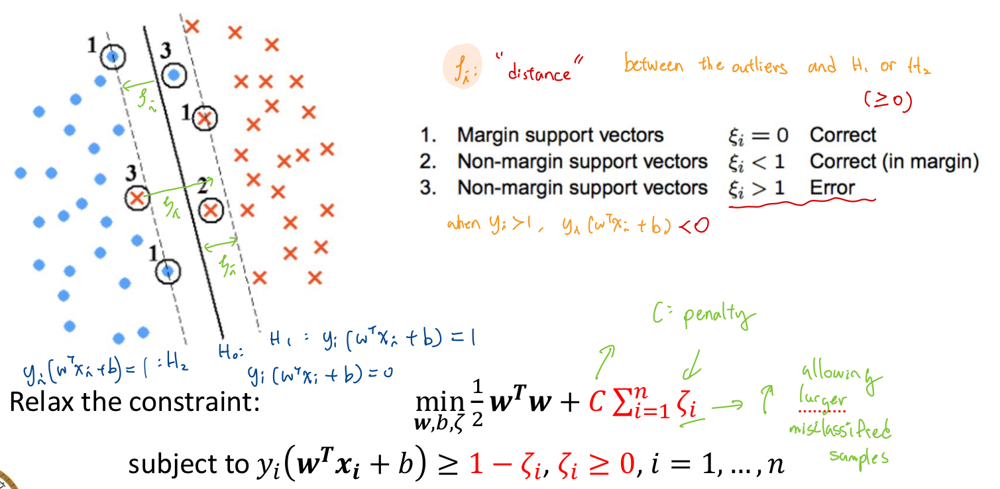
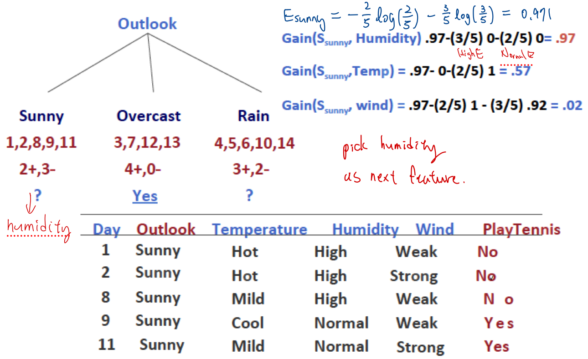

# Deep Learning in Computer Vision Class Note

# Introduction (week: 02/20)

## AI Branches

**AI (Artificial Intelligence):**
The broadest term, AI refers to the simulation of human intelligence in machines, enabling them to perform tasks that typically require human cognition, such as reasoning, problem-solving, and decision-making.

**ML (Machine Learning):**
A subset of AI, ML involves training algorithms to learn patterns from data and make predictions or decisions without explicit programming. ML models improve performance with more data over time.

**DL (Deep Learning):** 
A specialized subset of ML, DL uses neural networks with multiple layers (deep neural networks) to process large amounts of data and perform complex tasks such as image recognition, natural language processing, and autonomous driving.

## Categories of Machine Learning

**Supervised learning:**
- label/ground-truth of data is given
- A type of machine learning where the model is trained on labeled data, mapping inputs to known outputs.

**Unsupervised learning:**
- label/ground-truth of data is unknown.
- A type of machine learning where the model finds patterns and structures in unlabeled data without predefined outputs.
- transforming the data into other representations.
- ex: image processing, e.g., local binary pattern  
clustering: e.g., k-means clustering

**Reinforcement learning:**
determine the optimal policy (i.e., the best
set of actions) based on the `reward` learn from the `environment`.

## Computer Vision
Make the computers understand images and videos. Identify relationships between objects in the image through image processing.

**More Applications: Vision in Space**  
Vision systems (JPL) used for several tasks:  
- Panorama stitching:  
① detect feature points in image pairs.  
② Find matching features in adjacent images.  
③ Use a unified coordinate sys, to stitch the images together.
- 3D terrain modeling:  
① Detect feature points  
② obtain camera projection matrix.  
③ project those feature points back to their 3D coordinates
- Obstacle detection, position tracking
- For more, read “Computer Vision on Mars” by Matthies et al.

# Data Representation and Normalization (week: 02/24)
- Conventional ML : Use engineered (human selected) features to train model
- DL : Train model with raw data, the model will automatically extract features for you

## Data Representation
prior to training a model, you must determine:  
➢ label ground-truth: eg. binary classification 0 or 1  
➢ representation of input:  
> - raw data : DL
> - transform to other features : ML

## Normalization (Feature scaling)
**When:** Input features have different order of magnitudes  
**Why:** poor performance due to:  
➢ Dominance of feature     
➢ Numerical stability  
➢ Convergence issues  

**Methods:**
-  Min-Max Normalization:  (normalize to 0 - 1)  
$x[:, j]_{normalization} = \frac{x[:, j] - min(x[:, j])}{max(x[:, j]) - min([:, j])}$    
    ➢ Feature-wise scaling, across all the samples  
    ➢ Most common scaling technique  
    ➢ cons: think about inherent constraints in physics

- Mean normalization:

- Z-score:

**How to apply:**  
- Classification  
➢ Usually no scaling in outputs.  
➢ Need scaling in inputs.  
- Regression  
➢ Usually need to scale in both inputs and outputs.  
➢ If you do scaling while training the model, need scaling    during testing  

    **🔹Testing Data:**  
    1. apply feature transformation  
    2. scaling input & output using the same scaling factors   employed during training
    3. scale the predictions back to original values. 

    

# Model evaluation (week: 02/27)

## Assumption in Machine Learning
- How you determine your training dataset so that your model works
on the unseen (test) dataset?  
    1. Training dataset must be ``representative enough``
    2. In other words, training and testing datasets are  `on the same distribution`  

    

## Robustness Evaluation
**Goal:** check how bad your model could be when you change your selection of training and testing data set.  
1.  Do **repeated trials**! (Change the selected training and testing)
2.  show **statistics** of the performance of your model on
the **testing dataset**  ex: boxplot, normal distribution of multiple trials.

## Overvitting 
 **Overfitting:** model works well on training dataset, but performs poor on testing dataset.  
 - Blue dots: 2D feature vectors of men images  
 - Red dots: 2D feature vectors of women images  
 - Green curve: an overfitted model
 - Black curve: a more general model

   

 > *Detect Outliers: Suppose small portion of outliers => How to detect outliers?  
Once the model is trained appropriately it should be a general model. Feed the training samples into the model to make predictions. the samples with relatively larger
**"prediction error"** could be potential outliers.

### Reasons and solutions to Overfitting
1. Training dataset is not representative 

    ➔ re-select the training samples  

2.  Model complexity is high  

    ➔ reduce the model complexity  

3.  Train too much   

    ➔ reduce the number of training epochs

### When to stop Training
 

1. keep testing dataset for final evaluation
2. Stop when error(loss) on **validation dataset start to increase**   

(Overfit: accuracy of training dataset high validation low. Underfit:accuracy of training dataset low validation low )

## Confusion matrix and Accurracy
### **Example Interpretation of a ROC Figure & Using Confusion Matrix**

#### **Scenario: Fraud Detection Model**
We trained a **binary classification model** to detect fraudulent transactions. The **ROC curve and AUC score** help evaluate model performance, while the **confusion matrix** shows how predictions are classified.

---

### **1️⃣ Understanding the ROC Figure**
#### **Given Data:**
- **AUC = 0.87**
- The **ROC curve rises steeply** and approaches the top-left corner.

#### **Interpretation:**
- **AUC = 0.87** → The model is **good at distinguishing fraud and non-fraud cases** (87% accuracy in ranking).
- The **curve is above the diagonal line**, meaning the model performs **better than random guessing**.
- A **higher threshold** (e.g., 0.8) reduces false positives but increases false negatives.
- A **lower threshold** (e.g., 0.3) catches more fraud cases but also increases false alarms.

📌 **If detecting fraud is critical**, we **lower the threshold** to **increase recall** (catching more fraudulent cases).

---

### **2️⃣ Confusion Matrix Interpretation**
The **confusion matrix** helps analyze classification errors at a chosen threshold.

#### **Confusion Matrix Example (Threshold = 0.5)**
| **Actual \ Predicted** | **Non-Fraud (0)** | **Fraud (1)** |
|------------------------|------------------|--------------|
| **Non-Fraud (0)**  | 900(TP) | 50(FN) |
| **Fraud (1)** (FN) | 30(FP)  | 20(TN) |

📌 **Key Metrics from the Confusion Matrix:**
- **True Positives (TP) = 20** → Fraud correctly detected.
- **False Positives (FP) = 50** → Non-fraud wrongly classified as fraud.
- **True Negatives (TN) = 900** → Correct non-fraud classifications.
- **False Negatives (FN) = 30** → Fraud cases **missed** by the model.

📌 **Key Insights:**
1. **Precision (TP / (TP + FP)) =** 20 / (20 + 50) = 0.29 (29%)
   - **Low precision** → Many false positives (wrongly flagged transactions).
2. **Recall(TPR) (TP / (TP + FN)) =** 20 / (20 + 30) = 0.40 (40%)
   - **Low recall** → Many fraud cases are missed.
3. **Accuracy = (TP + TN) / (Total Predictions)** = (20 + 900) / 1000 = 92%
   - **Accuracy is high, meaningless if dataset is highly unbalanced.** Might be misleading if fraud cases are rare.
4. **FPR = FP / (FP + TN)** = 30 / (20 + 30) = 60%
---

### **3️⃣ Adjusting the Threshold Using ROC**

- **Lower the threshold (e.g., 0.3)** → Increases recall (fewer missed frauds) but may increase false positives.
- **Raise the threshold (e.g., 0.7)** → Reduces false positives but **misses more fraud cases**.  

#### When to Prioritize High TPR(better) or Low FPR(better)?
**Trade-off:** high TPR often comes at the cost of a high FPR 
**Solution:** Combine high TPR with precision to avoid too many false positives.
| **Scenario** | **Prioritize High TPR (Low FN)?** | **Prioritize Low FPR (Low FP)?** |
|-------------|--------------------------------|------------------------------|
| **Medical Diagnosis (e.g., Cancer, COVID-19)** | ✅ Yes (Missing a real case is dangerous) | ❌ No |
| **Spam Detection** | ✅ Yes (Better to overfilter than miss spam) | ❌ No |
| **Fraud Detection** | ✅ Yes (Better to block fraud than allow it) | ❌ No |
| **Airport Security Screening** | ✅ Yes (Better safe than sorry) | ❌ No |
| **Hiring/Resume Screening** | ❌ No | ✅ Yes (Avoid rejecting good candidates) |
| **Autonomous Vehicles (Self-Driving Car Stop System)** | ❌ No | ✅ Yes (Avoid unnecessary stops) |
| **Criminal Investigations** | ✅ Yes (Find suspects) | ✅ Yes (Avoid accusing the wrong person) |

---

### **4️⃣ When to Use ROC vs. Confusion Matrix?**
| **Situation** | **Use ROC-AUC?** | **Use Confusion Matrix?** |
|--------------|-----------------|----------------------|
| Overall model performance | ✅ Yes | ❌ No |
| Deciding the best threshold | ✅ Yes | ✅ Yes |
| Analyzing classification errors | ❌ No | ✅ Yes |
| Imbalanced dataset | ❌ No (Use PR-AUC) | ✅ Yes |

---

### **-Final Takeaways**
✔ **ROC Curve** helps determine **optimal threshold trade-offs**.  
✔ **AUC Score** summarizes model performance (**higher is better**).  
✔ **Confusion Matrix** shows actual vs. predicted classifications.  
✔ **Threshold tuning is necessary** to balance precision and recall.

## Support Machine Vectors
**Support vector machine (SVM)** is a very popular algorithm in
machine learning (ML) community.
- Can do classification problems.  
- Can do regression problems.  
- Find the hyperplane that separates different classes.  
- May require a kernel function to project the data into higher
dimension spaces.  

    

### Hard SVM (Linearly-Separable Case)
Recall on a 2D plane, we define a line with the equation:  
- $𝑙: 𝐴𝑥 + 𝐵𝑦 + 𝑏 = 0$  
- In SVM, we usually denote the inputs as $𝒙_{i} = [x_{1}, x_{2},...,x_{p}]^{T}$,, and the
corresponding label as $y_{i} = [1 or -1]$  for binary classification.
- Assume the input space is 2D (i.e., 𝑝 = 2), the same line $l$ can be
represented as: 
$$
w = 
\begin{bmatrix} 
  A \\
  B \\ 
\end{bmatrix}, 

x = 
\begin{bmatrix} 
  x_{1} \\
  x_{2} \\ 
\end{bmatrix},
𝑙: w^{T}𝑥 + 𝑏 = 0
$$

- Define the hyperplane: $H_{0}:  w^{T}_{0}x + b_{0} = 0$, we want to find the optimal 𝒘 so that the margin is the largest.  
Why largest margin? Ans: Avoid Overfitting

- How to compute the margin?

  
  
  -  Support vectors: points on 𝐻1 and 𝐻2: $x_{+}$ & $x_{-}$
   - To maximize the margin 2d, we need to minimize $\left \| w \right \| \ $
   - to minimize $\left \| w \right \| \ $, we should minimize 

       $min(\frac{1}{2}w^{T}w) = \frac{1}{2}\left \| w \right \|^{2}$    
       subject to $y_{i}(w^{T}x_{i}+b)\geq 1, i = 1,...,n$

 
    
### Soft SVM (Non-Separable Case)
#### What if there are Noise/Outliers:
 

- we can relax the constraint by    
➜ decreasing penalty C (to increase $\zeta_{i}$ allowing more misclassified examples)

#### What if the data cannot be separable in the original space?

- Use a kernel function 𝜙(∙) to map the inputs into a higher dimensional space to be separated with a hyperplane.  
- Once you map the inputs, following the same formulation in soft SVM.

### Remarks
- These SVM is a **constrained optimization**(vs.unconstrained) problem
- The equations mentioned above are **primary form** of SVM
-  However, in practice the above optimization problem is solved by its **dual form**.  
>#### **Dual form :**
>- leverages the **kernel trick**, making the
optimization process **more efficient**  
>- can be implemented using gradient descent
>- Instead of optimizing 𝒘 explicitly, the dual form only
depends on the on the samples $x_{i}$ through kernel products.   
 $\sum \alpha \cdot \phi ( x _ { i } ) \cdot \phi ( x _ { j } )$  
>- There are other variants of SVM algorithms. SVM can also be used in
**regression problems**.
>- Further reading:  
Ch. 11.5 in: http://ciml.info/dl/v0_99/ciml-v0_99-ch11.pdf  
scikit-learn: https://scikit-learn.org/stable/modules/svm.html#mathematical-formulation

### Hyperparameters
- any parameter in the algorithm that may affect the
performance.
- Usually you need to do **hyperparameter tuning** to find the best parameter set for your model.
any parameter in the algorithm that may affect the
performance.
- some important hyperparameter:

  - penalty 𝐶  
  - kernel function. E.g.: linear, polynomial, Radial Basis Function (RBF)  
  - Parameters in the kernel function

## K-nearest Neighbor
#### Steps:
1. Prepare a training dataset.
2. Apply appropriate **feature transformation**.  
3. Given a testing sample, compute the **distance** between the **testing sample** and **each training sample**.  
4. **Sort** the distances, and **choose the K value**.
5. Assign labels based on the **majority vote** of the K-nearest neighbors.

#### Hyperparameters:
- The K value.  
- The feature transformation you use.  
- The distance metric you use. eg:  
  
  $L2 norm:$ 
     $$
    w = 
    \begin{bmatrix} 
    A \\
    B \\ 
    \end{bmatrix}, 
     \left \| w \right \| \ ^2 = \sqrt { A ^ { 2 } + B ^ { 2 } }
    $$  

    $L1 norm:  | | \overrightarrow { w } | | = | A + B | = | A | + | B |$

#### Brainstorming:
- How does the **K value relate to overfitting**?  
    ➜  smaller 17 has the tendency to overfit eg. K = 1, affected by outliers.

- Is there any **“training”** involved in the solution process?  
    ➜ since you are just computing the distance between the testing samples and the training samples.

- Can K-nearest neighbor do **regression problems**?  
    ➜ yes, use **weighted average** $ \propto\frac { 1 } { distance} $ of the training samples.
    
    - prediction:   
      $v _ { 1 } \cdot \frac {\frac { 1 } { d _ { 1 } } } { \frac { 1 } { d _ { 1 } } + \frac { 1 } { d _ { 2 } } + \frac { 1 } { d _ { 3 } } } + v _ { 2 } \cdot \frac {\frac { 1 } { d _ { 2 } } } { \frac { 1 } { d _ { 1 } } + \frac { 1 } { d _ { 2 } } + \frac { 1 } { d _ { 3 } } } + v _ { 3 } \cdot \frac {\frac { 1 } { d _ { 3 } } } { \frac { 1 } { d _ { 1 } } + \frac { 1 } { d _ { 2 } } + \frac { 1 } { d _ { 3 } } } $
      

## Decision Tree (03/13)  
 Decision tree (DT) is a straightforward algorithm in machine learning (ML).

- Usually used in classification problems.  
- Make prediction based on attributes, i.e., features.  
- Rule-based ML.  
- Core concept: determine the optimal order of features to be used in the tree. 

### Entropy
a measure of **disorder**.
>$$
\text{$H(p_1, p_2, ..., p_K) = - \sum_{i=1}^K p_i \log_2(p_i)$}
$$
- The higher the entropy, the higher the disorder.
- $𝑝𝑖$ : the probability of a sample being Class $𝑖$. $𝐾$: number of classes.  
Example:  

- Intuition: At each **parent node**, pick the **feature** such that, the resulting **entropy** at the **children nodes** are **minimized**.  
  

### Information Gain
How much you reduce the entropy.

    

$𝑆$ : samples at parent node; $𝐴$: the selected feature; $𝑣$: values in feature $𝐴$; $|𝑆|$ number of samples at parent node; $|𝑠_{𝑣}|$ number of samples at child node when $𝐴 = 𝑣$.   
> ➜ Objective : At each **parent node**, find the feature $𝐴$ so that the **information gain** is the **largest**.

### Calculation

- DT Example:   
Will I play badminton today?  

1. Current Entropy (Parent node $H(s)$)  
   $p = \frac{9}{14}$

    $n = \frac{5}{14}$

    $H(s, label)=-\frac{9}{14} log_{2} (\frac{9}{14}) -\frac{5}{14} log_{2} (\frac{5}{14})\approx 0.94$
2. Determine children node  
- calculate each features information gain, select the highest.  
    > **Outlook :**  
   
**Humidity :**  
  
Temperature, Wind same calculation  

    >Information Gain:   
    >- Outlook: 0.246 (max)  
    >- Humidity: 0.151
    >- Wind: 0.048 
    >- Outlook: 0.029   

3. **Select & Split** on Outlook:  
Do the same thing at the next layer child node    
 
4. Final Results :  

      
- Note: If the **final entropy** at the children nodes are **not zeros**, do **major voting**.

### Avoid Overfitting and Other Variants of DT
- Strategies to avoid overfitting
    - Fix the **depth** of the tree.  
    - Check the performance of the **validation** dataset **while growing** the tree. Stop growing the tree if overfitting is observed.  
    - **Post pruning**: replace the sub-tree with majority vote.  
- Other variants of DT:
    - Random forest (RF).  
    - RF is an **ensemble learning** based approach. RF aggregates the
prediction of multiple decision trees.    
    
# Neural Networks
- The idea of a neural networks (NNs):   
NNs learn relationship between cause(input) and effect(output) or organize large volumes of data into orderly and informative patterns.  
- Inspiration from Neurobiology:  
    - A biological neuron has three types of main components: dendrites, soma (or cell body) and axon.  
    - Dendrites receives signals from other neurons.  
    - The soma, sums the incoming signals. When sufficient input is received, the cell fires, that is, it transmit a signal over its axon to other cells.

- Artificial neurons:  
  
    - From experience: examples / training data  
    - Strength of connection between the neurons is stored as a weight-value
    for the specific connection  
    - Learning the solution to a problem = changing the connecting weights

## Network Architecture  
- A typical neural network (NN):  
  
    - A neural net consists of a large number of simple processing elements
    called **neurons**, units, cells or nodes.  
    - Each **neuron** is **connected** to other neurons by means of directed
    communication links, each **with associated weight**.
- Consider a single neuron:  
     
    >- Why do we need an activation function?  
    >learn Non-linear relationship between input and output.  

## Activation functions:
 