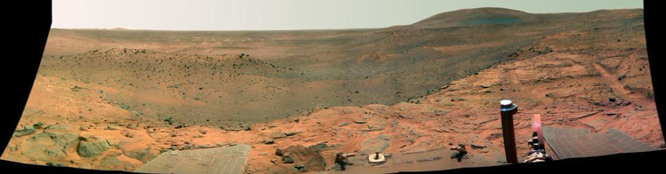

# Deep Learning in Computer Vision Class Note

# Introduction (week: 02/20)

## AI Branches

**AI (Artificial Intelligence):**
The broadest term, AI refers to the simulation of human intelligence in machines, enabling them to perform tasks that typically require human cognition, such as reasoning, problem-solving, and decision-making.

**ML (Machine Learning):**
A subset of AI, ML involves training algorithms to learn patterns from data and make predictions or decisions without explicit programming. ML models improve performance with more data over time.

**DL (Deep Learning):** 
A specialized subset of ML, DL uses neural networks with multiple layers (deep neural networks) to process large amounts of data and perform complex tasks such as image recognition, natural language processing, and autonomous driving.

## Categories of Machine Learning

**Supervised learning:**
- label/ground-truth of data is given
- A type of machine learning where the model is trained on labeled data, mapping inputs to known outputs.

**Unsupervised learning:**
- label/ground-truth of data is unknown.
- A type of machine learning where the model finds patterns and structures in unlabeled data without predefined outputs.
- transforming the data into other representations.
- ex: image processing, e.g., local binary pattern  
clustering: e.g., k-means clustering

**Reinforcement learning:**
determine the optimal policy (i.e., the best
set of actions) based on the `reward` learn from the `environment`.

## Computer Vision
Make the computers understand images and videos. Identify relationships between objects in the image through image processing.

**More Applications: Vision in Space**  
Vision systems (JPL) used for several tasks:  
- Panorama stitching:  
① detect feature points in image pairs.  
② Find matching features in adjacent images.  
③ Use a unified coordinate sys, to stitch the images together.
- 3D terrain modeling:  
① Detect feature points  
② obtain camera projection matrix.  
③ project those feature points back to their 3D coordinates
- Obstacle detection, position tracking
- For more, read “Computer Vision on Mars” by Matthies et al.

# Data Representation and Normalization (week: 02/24)
- Conventional ML : Use engineered (human selected) features to train model
- DL : Train model with raw data, the model will automatically extract features for you

## Data Representation
prior to training a model, you must determine:  
➢ label ground-truth: eg. binary classification 0 or 1  
➢ representation of input:  
> - raw data : DL
> - transform to other features : ML

## Normalization (Feature scaling)
**When:** Input features have different order of magnitudes  
**Why:** poor performance due to:  
➢ Dominance of feature     
➢ Numerical stability  
➢ Convergence issues  

**Methods:**
-  Min-Max Normalization:  (normalize to 0 - 1)  
$x[:, j]_{normalization} = \frac{x[:, j] - min(x[:, j])}{max(x[:, j]) - min([:, j])}$    
    ➢ Feature-wise scaling, across all the samples  
    ➢ Most common scaling technique  
    ➢ cons: think about inherent constraints in physics

- Mean normalization:

- Z-score:

**How to apply:**  
- Classification  
➢ Usually no scaling in outputs.  
➢ Need scaling in inputs.  
- Regression  
➢ Usually need to scale in both inputs and outputs.  
➢ If you do scaling while training the model, need scaling    during testing  

    **🔹Testing Data:**  
    1. apply feature transformation  
    2. scaling input & output using the same scaling factors   employed during training
    3. scale the predictions back to original values. 

    

# Model evaluation (week: 02/27)

